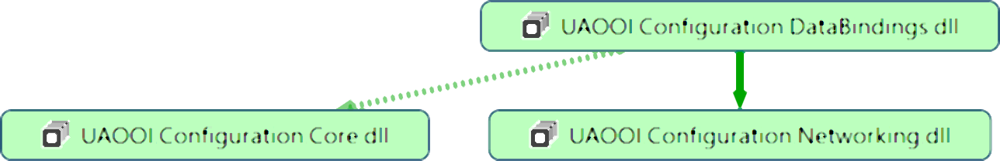

# Configuration - Executive Summary

## Introduction

This library contains types that support the configuration management of application implementing the paradigm described in [Semantic-Data Processing Architecture](../SemanticData/README.MD#ooi-reactive-application). By design, this library may be used to support a variety of application types at design and run time.

The project is to be a prototyping workspace to answer the question of how far we can go with the configuration (design-time approach) in the context of the following problems we have:

1.  all about how to establish semantic-context, i.e. to make data exchange meaningful 
  - message encoding, i.e. process data selection, and message populating
  - message decoding – preparation of the consumer to be able to decode the messages, i.e. to make the message meaningful
2. all about how to establish security-context, i..e. to make data exchange secure
  - Privileges/Permissions management in the context of the mobile data as the primary resource (subject) for any OPC UA data processing application and context of the message handlers as the data access communication channels (infrastructure)
  - Security artifacts distribution to support all scenarios mentioned above

## Architecture

The relationship between the assemblies in this namespace is illustrated in the following figure.



>Where:
>
>- `DataBindings` - this library is aimed at implementing an independent editor of the `OOI Reactive Application` (`RxNetworking`) configuration file
>- `Networking` - this library contains types that support the configuration management of the `OOI Reactive Application` (`RxNetworking`)
>- `Core` - The library contains core definitions for "DataBindings" to promote late binding and loosely coupled components interaction

## Features

By design libraries in this namespace
- allow editing and saving the configuration in the **XML** or **JSON** formats
- promotes dependency injection pattern
- enable dynamic configuration to reload after modification and discovery functionality

The dependency injection allows the composition of the hosting application using a late-binding approach and as a result replacing the used parts after deploying the main library. It requires loosely coupled parts.

## Prerequisites

By design, the Configuration libraries depend on a logger functionality implementing the interface

```txt

UAOOI.Common.Infrastructure.Diagnostic.ITraceSource

``` 

defined in the `UAOOI.Common.Infrastructure` package. It is used to trace the behavior of libraries at run-time. To get an instance implementing this interface the `CommonServiceLocator` is used. The functionality required by the `CommonServiceLocator` has to be provided by the hosting application. Usually, it is provided by the composition container that is built at the application bootstrap stage. To get more visit this library home page [Microsoft.Practices.ServiceLocation at GitHub](https://github.com/unitycontainer/commonservicelocator).

> If the `CommonServiceLocator` is not available a default logger (do nothing) is used. 


## How to guide

### How to use the library by the configuration editor tool

The following code snippet demonstrates how to use this library set by a configuration editor tool.

```C#

public class ConfigurationEditorBase : IConfigurationEditor { ... }
public class InstanceConfigurationFactory : IInstanceConfigurationFactory { ... }

```

Implementation of this scenario is covered by a full-featured example managed in an independent repository [Object Oriented Internet Reactive Networking Configuration Editor](https://github.com/mpostol/OPC-UA-OOI.ConfigEditor). Implementation of the above-mentioned interfaces is supported by the libraries that provide a vast variety of helper classes.

### How to use the library by the RxNetworking (OPC UA PubSub) communication application

For the XML format, an example illustrating the reactive networking (`RxNetworking`) atop of the OPC UA PubSub is the `UAOOI.Networking.DataLogger.ConsumerConfigurationFactory` class. The following code snippet demonstrates this case. To get more examples of how to design custom configuration, visit the document covering [`RxNetworking configuration][RxNetworkingConfig].

```C#
internal class ConsumerConfigurationFactory : ConfigurationFactoryBase<ConfigurationData>
{
  ...

  public ConsumerConfigurationFactory(string configurationFileName)
  {
    Loader = LoadConfig;
    m_ConfigurationFileName = configurationFileName;
  }

  private ConfigurationData LoadConfig()
  {
    FileInfo _configurationFile = new FileInfo(m_ConfigurationFileName);
    return ConfigurationDataFactoryIO.Load<ConfigurationData>(() => XmlDataContractSerializers.Load<ConfigurationData>(_configurationFile, (x, y, z) => { }), () => RaiseEvents());
  }
  ...
}
```

## See Also

- [Reactive Networking (RxNetworking) Configuration][RxNetworkingConfig].
- [API Browser][API Browser]: the preliminary code help documentation.
- [OPC UA Address Space Model Designer (ASMD) - GitHub repository with related work][ASMD]

[RxNetworkingConfig]:./Networking/README.MD
[API Browser]:http://www.commsvr.com/download/OPC-UA-OOI/index.html
[ASMD]:https://github.com/mpostol/ASMD
