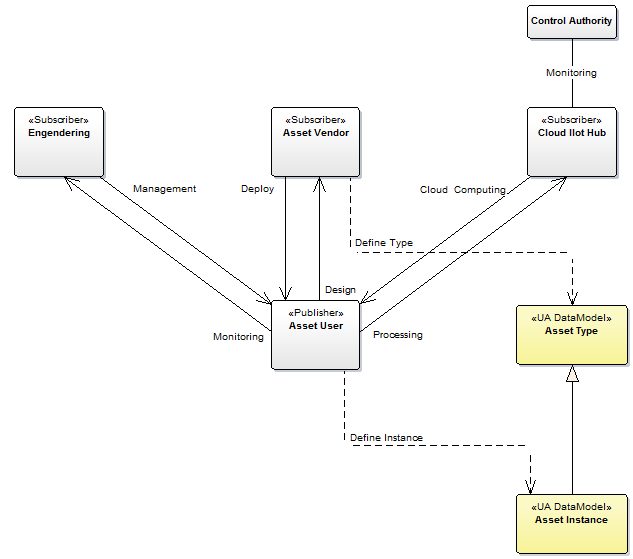

# Domain Model of the Global Data Discovery

## Main goals
* To promote systems integration against data type definitions.
* To promote separation of concerns.

## Roles and Activities

The following diagram presents domain model of the **Data Discovery** concept.

On the diagram the following artifacts are distinguished:

* *Generic Process* - *Control Agency* (e.g. Pollution Control Agency) prepares a *Generic Process* information model to meet monitoring requirements.
* *Asset* - *Asset Vendor* (e.g. boilers vendor) adapts the *Generic Process* model and creates derived *Asset* model to meet the product requirements with the purpose of continuous development and real time control.
* *Maintenance* - *Engineering* organization (e.g. boiler maintenance service provider) according to the local needs adopts the *Asset* OPC UA information model to meet maintenance requirements on behalf of the *Asset User* (e.g. Heat and Power Plant).
* *Data Domain* - *Asset User* is ultimate owner of the data. *Engineering* on behalf of the user prepares the **Data Domain** OPC UA Information Model that could be uniquely identified in the global scope.

Finlay the presented scenario the subscriber configurations of the *Cloud IIoT Hub*, *Asset Vendor*, and *Engineering* are based on the prepared in advance **Data Domain** model to gather selected data.

Using the real time data the Pollution *Control Agency* are working to:

* reduce greenhouse gas emissions
* reduce harmful effects from air pollution and noise
* reduce the spread of substances harmful to health and environment

*Engineering* provides asset management and predictive maintenance services. This services involves the balancing of costs, opportunities and risks against the desired performance of assets to achieve the organizational objectives. All of these activities requires real time data access to achieve finally predictive maintenance.

*Asset Vendor* deploys the asset (thing) and uses the data for continuous improvement process.

*Cloud IIoT Hub* provides cloud computing services and processes the data to meet requirements of the *Control Agency*

*Asset User* as the owner of the asset (thing) publishes the data to make them available to all of the stakeholders.

> To achieve separation of concerns systems integration against type definition is required.
