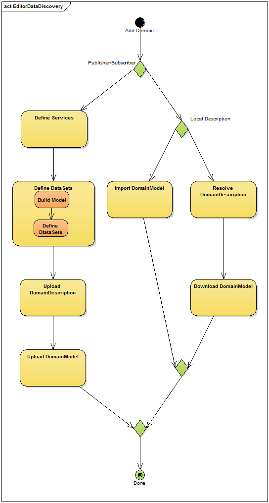

# Global Data Discovery

# Concept

In this approach, the URI of the OPC UA **Information Model** is to be used as a unique key to browse the _Global Data Discovery System_ \(GDDS – an expanded version of GDS\) to find recursively the destination _OPC UA Server_ or _UA Data Application_ exposing the requested data.

The main assumptions of the concept are covered in the document:  
[Discoverable Data](../SemanticData/README.MD#discoverable-data)

The URI syntax is described in the document: [Uniform Resource Identifier \(URI\): Generic Syntax](http://tools.ietf.org/html/rfc3986).

The **Data Discovery** procedure may be applied to the following scenarios:

* **Design time data discovery** - all about using data definition \(OPC UA Information Model - semantics\) to configure data bindings and data distribution over the wire.
* **Startup process** - all about bootstrapping process of the `OOI Reactive Application`.
* **Operational time** - all about dynamic data definitions and security stuff management \(certificates, keys\)

Design time data discovery process is illustrated in the activity diagram:

* 

The startup process of an `OOI Reactive Application` is illustrated in the activity diagram:

* 

The proposed concept is scalable and could be used in local and global scope depending on the available resources. A domain model describing a scenario where this approach is applicable is covered in the document [Domain Model of the Global Data Discovery](./DomainModel.md).

# Data semantics

In the discovery process the semantics of the data is layered as follows:

1. Value encoding \(serialization\), e.g. double, Int32, Boolean,
2. Value meaning, e.g. pressure, temperature, flow, etc.
3. Values relation, e.g. boiler object type containing relation between drum, input pipe and flow neater.
4. Process – data source, e.g. set of boilers: `Boiler #1`, `Boiler #i`, ...., `Boiler #N` located at…..

Semantics of the data is expressed using types. Process data is available as the Variables described by types.

> Conclusion  
> The discovery process must address:
>
> * the data types - to get meaning and design data management and processing
> * the data values - to get current process state and control it

# URI resolver

```
        foo://example.com:8042/over/there?name=ferret#nose
         \_/  \______________/ \________/ \_________/ \__/
          |           |            |            |       |
       scheme     authority       path        query  fragment
```

It is assumed that the **Data Domain** description is provided by the discovery services resolved from the **OPC UA Information Model** URI.

The main challenge is where the recursive resolution process shall start. It seems we have the following options:

1. Direct - the URI is URL of the XML/Json files containing all definitions required to configure application.
2. Authority part of the model URI is a DNS entry \(see also: [DOMAIN NAMES - CONCEPTS AND FACILITIES
   ]([https://tools.ietf.org/html/rfc1034](https://tools.ietf.org/html/rfc1034)) \)  in the information model URI zone – on promise services.  
3. A selected root HTTP services, e.g. in the opcfoundation.com domain.

# Solution

The discovery procedure is based on the following records:

* `DomainModel`: contains information about data available in the selected **Data Domain**.
* `DomainDescriptor`: contains information about how to find and download `DomainModel`.

The recovery and resolving procedure is based on the Restful \(Representational State Transfer\) Web API style with the goal that the system can evolve over a long period of time and can tolerate many different clients and many different changes without breaking those clients.

# Content

* `DataDiscovery` - Library supporting global data discovery services.
* `Tests` - test projects.


