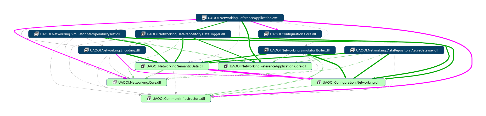

# Walk-through `ReferenceApplication`

## Introduction

The topics contained in the document [Getting Started Tutorial](../../Networking/SemanticData/READMEGettingStartedTutorial.md) are intended to give you quick exposure to the `OOI Reactive Application` network-based data exchange programming experience. Working through this tutorial gives you an introductory understanding of the steps required to customize existing `OOI Reactive Application`.

This project is aimed at implementation of an example of the `OOI Reactive Application` supporting producer and consumer roles simultaneously. The purpose of the `ReferenceApplication` is to demonstrate the concepts and architecture of the reactive networking application implementation, rather than to necessarily provide a realistic scenario for its use. For more extensive examples, see the [Semantic-Data Processing Architecture](../../SemanticData/README.MD).

The `ReferenceApplication` hosts parts offering `Producer` and `Consumer` functionality. Both roles are implemented as independent threads that have a common graphical user interface (GUI) for diagnostic and configuration purpose.
 
The `Producer` sends messages containing the fields defined in the configuration file using UDP communication stack. The values are simulated. The `Consumer` is configured to receive these messages from the UDP protocol stack. The `Consumer`to correctly decode the messages must have configuration defining the same set of fields. The data is encoded using *Variant* encoding.

The detailed description of the `Consumer` is covered by the document [`ReferenceApplication` Consumer - Data Logger](../../Networking/DataLogger/README.md). The detailed description of the `Producer` is covered by the document  [`ReferenceApplication` Producer - Interoperability Test Data Generator](../../Networking/SimulatorInteroperabilityTest/README.md).

Each role uses independent configuration file. The detailed description of the configuration maintenance is captured in the document [UA Data Networking Configuration](../../Configuration/Networking/README.MD#ua-data-networking-configuration).

<!--

Note: in current version it is not supported.

By the user interface (UI) remote host name and port numbers can be modified. The IP address is resolved using DNS. Use the update buttons to start communication to apply new settings. The user interface provides also some diagnostic information. All received values are logged and displayed as the list with the time prefix.

-->

## Architecture

The diagram below presents main parts making up the `ReferenceApplication` - an example application compliant with the *Object Oriented Internet* concept.

- `ReferenceApplication`: Reactive Networking of Semantic-Data Library WPF GUI layer - it exposes the startup entry point to the runtime environment.
- `DataLogger`: is an example of the `Consumer` part of the `ReferenceApplication`.
- `SimulatorInteroperabilityTest`: `Producer` implementation of a data generator to be used for testing purpose.
- `UDPMessageHandler`: proprietary UDP `IMessageHandlerFactory` implementation.
- `Encoding`: IEncodingFactory functionality  implementation limited to encoding simple data types for the testing purpose only.
- `ReferenceApplication.Core`: this library provides an implementation of a core functionality required by the `ReferenceApplication` and all its components that are helpful in writing well-structured and maintainable applications.
- `SemanticData`: *Reactive Networking of Semantic-Data Library* library based on [OPC UA Part 14 Pub/Sub](../../Networking/SemanticData/README.PubSubMTF.md).

## How to: Get Started

### Application Installation

The application is located on the GitHub at [OPC-UA-OOI](https://github.com/mpostol/OPC-UA-OOI) and maintained as the project `Networking.ReferenceApplication` of the solution `UAObjectOrientedInternet.sln`.

The current binary release containing ready to use application is available on the repository [Releases][OOI.Releases] page. Download and run the downloaded .exe file to unzip the content to selected folder. Now you may run the application file `UAOOI.Networking.ReferenceApplication.exe` to get started.

### Version History

Detailed description is available in file [ReadMe.txt](ReadMe.txt)

### Troubleshooting

For the diagnostic purpose, the application supports network transfer tracing that provides access to information about method invocations and network traffic generated by the application. This feature is useful for debugging applications under development as well as for analyzing deployed applications. The output provided by network tracing is customizable to support different usage scenarios at development time and in the production environment. Traces are to publish specific messages that are generated during application execution. To learn more about a configuration of the tracing visit the documentation at [Network Tracing in the .NET Framework](https://msdn.microsoft.com/en-us/library/hyb3xww8.aspx). 

The log file `UANetworkingReferenceApplication.log` captures output messages from some public methods of the `Socket`, `TcpListener`, `TcpClient`, and `Dns` classes. To find the log file location click the `Actions.Open Configuration folder` menu entry.

[OOI.Releases]:https://github.com/mpostol/OPC-UA-OOI/releases
