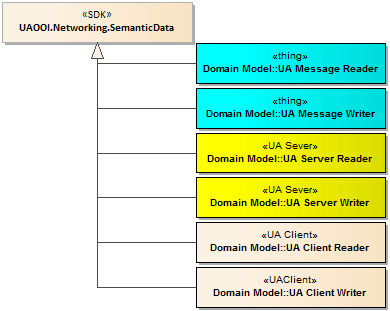
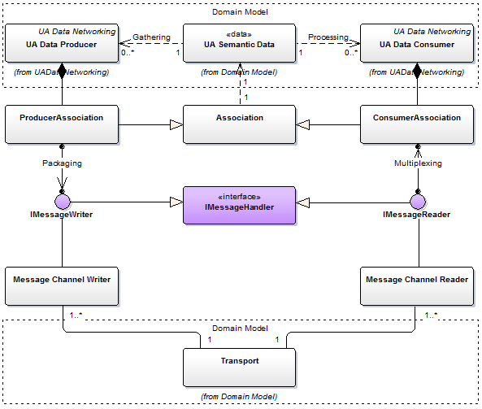
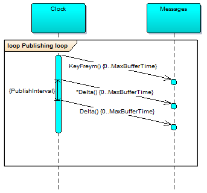

# Reactive Networking of SemanticData Library

## Getting Started

The `UAOOI.Networking.SemanticData` library is designed to be a foundation of developing application programs that are taking part of message-centric communication pattern and interconnected using the reactive networking concept described in the [OOI Semantic Data Processing Architecture](../../SemanticData/README.MessageCentricCommunication.md). The diagram below presents how to engage this library to provide a more specific functionality required depending on the role of concern compliant with the overall architecture.

For more in-depth information about creating `OOI Reactive Application` exchanging data over the network using the reactive networking pattern, see [Getting Started Tutorial](./READMEGettingStartedTutorial.md).

To promote interoperability this library is a collection of types aimed at implementation of the [Part 14 PubSub](README.PubSubMTF.md) standard.

The code is tested using the Unit Tests located in the project: [SemanticDatalUnitTest][OPC-UA-OOI.Networking.Tests.SemanticDatalUnitTest]

The preliminary code help documentation is here: [API Browser](http://www.commsvr.com/download/OPC-UA-OOI/?topic=html/N-UAOOI.Networking.SemanticData.htm)

> NOTE: The project is in development stage - major changes are expected.

## Reactive Networking Application Architecture

The figure below shows the relationship between the library `UAOOI.Networking.SemanticData` and external parts compounding any reactive networking application (`OOI Reactive Application`). The `OOI Reactive Application` is collection of `Producer` and `Consumer` entities. They must provide an interface to real-time process data, hence they are recognized as an extension of `DataRepository` class. To implement the `DataRepository` dedicated implementation [`IBinding`](http://www.commsvr.com/download/OPC-UA-OOI/?topic=html/T-UAOOI.Networking.SemanticData.DataRepository.IBinding.htm) interface should be provided to create a bridge between real word data `Row Data` represented by the `LocalResources` class. 

Any application engaging the library is composed using the dependency injection pattern. The `DataManagementSetup`class is a placeholder to gather all external injection points used to compose the application, initialize the communication and bind to local resources. 

To promote flexibility and the separation of concern design approach, the concreted types are loosely coupled with the library. It means, that the selection of the concrete types used to compose the application is up to the application, namely it may designate them at runtime. To conform to the library requirements all the classes must implement appropriate contract defined as an interface.

- `Configuration`: represents functionality needed to read the configuration and handle the configuration modification at runtime. This functionality must be supported by the deployment platform. The library described in the article [UA Data Networking Configuration](../../Configuration/Networking/README.MD#ua-data-networking-configuration) provides helper classes that may be used to gather all required information from the configuration files to instantiate the communication infrastructure and start pumping the data. This class must implement the [`IConfigurationFactory`](http://www.commsvr.com/download/OPC-UA-OOI/?topic=html/T-UAOOI.Configuration.Networking.IConfigurationFactory.htm) interface. Each `Publisher` and `Consumer` must provide its own configuration.

- `DataRepository`:  represents local resources in the application, for example PLC registers, HMI variables binded to screen controls, internal register of smart meters, etc. Depending on the role the library supports:

  - `Consumer` - recovering data from message and writing to local resource.
  - `Producer` - reading data from the Local resource, populating a new message with this value and sending the message over the wire.

- `MessageHandling`: is a part providing the message handling services. The communicating party can be interconnected using any transparent messages transport infrastructure. For the broker-less transport layer the network infrastructure routes datagram-based messages and the `MessageHandling` should implement `UDP`, `AMQP` or `ETHERNET` protocol. Applying the broker-based approach a core component of the transport layer is a message broker and in this case the `MessageHandling` should implement `AMQP` or `MQTT` protocol.

- `Encoding`: A method stub or simply stub in software development is a piece of code used to stand in for some other programming functionality. A stub may simulate the behavior of existing code (such as a procedure on a remote machine, such methods are often called mocks) or be a temporary substitute for yet-to-be-developed code.

## Internal Architecture

### Introduction

In figure below the relationship of the internal implementation with the overall domain model is presented.

* It is assumed that the data consumer is lightweight and may support limited encoding/decoding functionality. The functionality will be  provided as a plug-in library injected at run time. EncodingDecoding is recognizable using a pair of: name recovered from the Type object and OPC UA DataType represented by its URI.
* Data binding - it is assumed that the binding of Local repositories/variables and messages content items is provided by the configuration. It could be also provided at runtime by updating the configuration using any external mechanism.

### Data management and binding

Description of the domain model of the data management and binding is covered in the article [Data management and binding](./READMEDataDiscoveryAndBinding.md).

### Bindings and encodings implementation

Binding between the local repository `DataRepository` (e.g. HMI Screen, OPC UA Server Address Space) and the message content items is provided by the `IBinding` interface and its basic implementation `Binding` class. This class is responsible to decode the data from the format used to construct the message to the local type. The decoders are factored by the external class `Encoding`. See definition for details: `IBinding`.
It is expected that the value conversion (decoding) is provided by an instance of the IValueConverter class. If it is not applicable the [Adapter patern](http://www.dofactory.com/net/adapter-design-pattern) must be used.

### Message Transport

Message Transport will not be implemented as the library part. This functionality must be injected form outside by implementing the interfaces:

* `IMessageHandler`: provides basic functionality handling messages communication over the wire.
* `IMessageReader`: provides functionality supporting reading the messages from the wire.
* `IMessageWriter`: provides functionality supporting sending the messages over the wire.

The library provides basic implementation of the above mentioned interfaces. In following diagram an implementation provided by the library is presented.

Hope is that the abstraction will support any types of message based communication layer.
The library provides basic implementation of the `Message` class that supports package level encoding/decoding functionality.

### Messages Sequence

## Testing

See how it works in the unit test class: [SemanticDatalUnitTest][OPC-UA-OOI.Networking.Tests.SemanticDatalUnitTest].

The [UA Data Example Application](../../Networking/ReferenceApplication/README.MD#ua-data-example-application) contains a reference WPF application.

[OPC-UA-OOI.Networking.Tests.SemanticDatalUnitTest]:https://github.com/mpostol/OPC-UA-OOI/tree/master/Networking/Tests/SemanticDatalUnitTest

## Current release

The NuGet package is available at:

[UAOOI.Networking.SemanticData](https://www.nuget.org/packages/UAOOI.Networking.SemanticData/)
