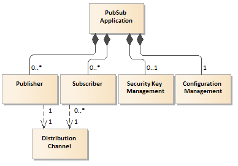
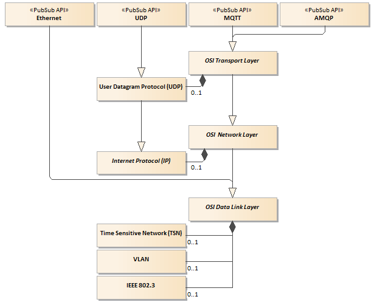

# OPC UA PubSub Main Technology Features

## Introduction

In general speaking the following two distinct patterns are used to transfer data between communicating parties:

- connection-oriented: requires a session that has to be established before any data can be sent between sender and receiver
- connectionless-oriented: the sender may start sending messages (called packets or datagrams) to the destination without any preceding handshake procedure

Each has its own advantages and disadvantages. In general, the OPC UA is a session centric communication. The session is established by the **OPC UA Clint** that must connect to the **OPC UA Server** before any data can be exchanged between them. In this Client/Server scenario defined by the [Services in Part 4][Opc.UA.Part4], the data flow is bidirectional over the session. The session entities communicate over a secure channel that is created in the underlying communication layer and relies upon it for secure communication. It enables to log-in using user authentication and operations authorization. More details you can find in the article:

- [OPC Unified Architecture – Main Technological Features][OPCUAMTF]

Using the connection-oriented communication pattern it is difficult or even impossible to gather and process data from mobile things (e.g. smart devices, cigarettes box, drug blister, etc.), which is one of the **Internet of Things** paradigms. More details you can find in [IoT versus SCADA/DCS Data Acquisition Patterns][wordpress.IoTVersus].

> The [OPC.UA.PubSub][OPC.UA.PubSub] specification offers the connectionless approach as an additional option to session based client-server interoperability and claims that it is a consistent part of the OPC UA specifications suit.
> **As a result, it may be recognized as the IoT ready technology.**

[OPC UA Part 14: PubSub][OPC.UA.PubSub] promotes interoperability of loosely coupled **PubSub Applications**. By design, they often will not even know each other. Their primary relationship is the shared understanding of:

- specific semantics (meaning) of exchanged data
- the syntax and semantics of messages that include these data
- common underlying messages transport layer

The specification claims that the PubSub integrates into the existing OPC UA technology but as result of applying the connectionless communication it is easier to implement low power and low-latency communications on local networks. Additionally, the specification states that PubSub is based on the [OPC UA Information Model][CAS.OPCUAIMD] with the aim of seamless integration into **OPC UA Servers** and **OPC UA Clients**. Nevertheless, the PubSub communication does not require such a role dependency, i.e. there is no necessity for **Publisher** or **Subscriber** to be either an **OPC UA Server** or an **OPC UA Client** to participate in the communication.

> **Note 1**: Unfortunately, [OPC UA Information Model][CAS.OPCUAIMD] is not used to promote **PubSub Applications** interoperability. This concept is only employed to define `Security Key Management` and `Configuration Management` models, which have an only indirect impact on the **PubSub Applications** interoperability.

## Services

**PubSub Applications** exchange messages formatted as the `NetworkMessage` structure using underlying communication stack. As illustrated in the following domain model (Figure 1), directly or indirectly the specification defines the following actors:

- `Publisher`: pushes the current process data formatted as the `NetworkMessage` structure to an underlying communication stack
- `Subscriber`: consumes the process data, which is recovered from the `NetworkMessage` structures polled from the underlying communication stack
- `Distribution Channel` - selected common underlying communication stack
- `NetworkMessage` - a data structure formatted in compliance with the syntax and semantics defined by the [OPC.UA.PubSub][OPC.UA.PubSub] specification
- `Security Key Management` - a service that provides security keys used to sign and encrypt `NetworkMessage` data structures
- `Configuration Management` - an external application used to remotely configure **PubSub Application**

The `Publisher` is the actor that pushes `NetworkMessage` structures to an underlying communication stack responsible to transport it over the network. It represents a certain data source, for example, a control device, a manufacturing process, a weather station or a stock exchange. It may be also **OPC UA Client**, **OPC UA Server** or in general any application that understand the syntax and semantics of the `NetworkMessage` structure.

The `Subscriber` actors are the consumers of `NetworkMessage` structures, which are polled from the underlying transport layer. They may be **OPC UA Client**, **OPC UA Server** or in general any applications that understand the syntax and semantics of the `NetworkMessage` structure.

To interchange the process data `Publisher` and all associated `Subscribers` nodes depend on a common `Distribution Channel`. `Distribution Channel` models common knowledge necessary to use an underlying messages transport communication stack, i.e. underlying protocol stack and relevant parameters to route the messages over the network.

A `Security Key Management` provides keys for message security that can be used by the `Publisher` to sign and encrypt `NetworkMessage` structures and by the `Subscriber` to verify the signature of and decrypt the `NetworkMessage`. The specification defines OPC UA Information Model for `Security Key Management` services that enables to implement this class as the **OPC UA Server** or **OPC UA Client**.

`Publisher` and `Subscriber` nodes may be configurable through vendor-specific engineering tools or using the dedicated configuration OPC UA Information Model described in this standard. This model allows a standard **OPC UA Client** based configuration tool to configure a **PubSub Application** connecting to the embedded **OPC UA Server**. Using remote **Configuration Tool** over an **OPC UA Session** does not determine how dynamic the configuration can be. More detailed description of this model is outside of the scope of this section.

> It is worth stressing that the configuration model doesn't provide any definition dedicated to being used for the process data bindings configuration.

## Interoperability

### Preface

The **PubSub Applications** are decoupled by exchanging messages over a selected underlying protocol stack. It is worth stressing that by design the **PubSub Application** doesn't expose any API that can be used to transfer upper layer data over the network, i.e. it is not a communication layer in the communication stack. It means that these applications must produce and/or consume the process data, i.e. the `NetworkMessage` must be populated using external process data.

### Transport Protocol Mappings

**PubSub Applications** interoperability doesn't depend on any functionality provided by the underlying transport layer. According to the specification, the **Subscriber** and **Publisher** can be interconnected using any transparent messages transport infrastructure. The specification defines two groups of solutions:

- *broker-less* - a network infrastructure that is able to route datagram-based messages, e.g. [UDP][RFC.UDP], [AMQP][AMQP], ETHERNET
- *broker-based* - the core component of the network infrastructure is a message broker, e.g. [AMQP][AMQP] or [MQTT][MQTT].

In both cases, the one-to-many relationship between `Publisher` and `Subscriber` can be obtained. For UDP multicast messages distribution may be applied to send `Internet Protocol (IP)` (figure below) datagrams to a group of interested receivers in a single transmission. For the broker-based transport, all messages are published to specific queues (e.g. topics, nodes) that the broker exposes and `Subscribers` can listen to these queues.

The [OPC.UA.PubSub][OPC.UA.PubSub] specification lists the following protocol stacks that can be selected as the transport for massages and their possible combinations with message mappings:

- OPC UA UDP - simple UDP based protocol that is used to transport UADP `NetworkMessages`
- OPC UA Ethernet - simple Ethernet based protocol using EtherType B62C that is used to transport UADP `NetworkMessages` as payload of the Ethernet II frame without IP or UDP headers
- AMQP - [Advanced Message Queuing Protocol (AMQP)][AMQP] based protocol that is used to transport JSON and UADP `NetworkMessage` structures
- MQTT - [Message Queue Telemetry Transport (MQTT)][MQTT] based protocol that is used to transport JSON and UADP `NetworkMessage` structures

Because the specification doesn't define normative references for `OPC UA UDP` and `OPC UA Ethernet` in section *References* they are inferred from the context. Based on this mapping in the figure below the architecture of protocol stack is determined as the domain diagram. The diagram has been worked out on the best effort approach.

> **Note 2** - for the sake of simplicity the diagram contains only protocols relevant for the mapping in concern. In other words, the classes representing the abstract OSI model layers (`OSI Transport`, `OSI Network`, and `OSI Data Link`) may aggregate and use a variety of protocols depending on the local network infrastructure, e.g. IEEE 802.11 for `OSI Data Link Layer`.

Following the specification, the transport protocol mapping is modeled as the four top-level classes called appropriately `Ethernet`, `UDP`, `MQTT`, `AMQP`. They may be recognized as the underlying API of the protocol stack and are aggregated into one common communication layer used to exchange the messages over the network (section *[Semantic-Data Message Centric Communication][SDMCC]* ).

Here it must be stressed that the mentioned in the section title term `transport protocol` has nothing in common with the Open System Interconnection Reference Model (OSI model) Transport Layer. Referring to the OSI model the `MQTT` and `AMQP` protocols should be recognized as the `OSI Application Layer` protocols. The `OSI Application Layer` is the one at the top of the model. For the sake of simplicity, the `OSI Application Layer` is not present in the diagram. Because the PubSub specification defines also the protocol on the same layer some functionality is redundant in this case - they overlap on each other. For the purpose of traversing the network by the messages, the **PubSub Application** uses `MQTT` and `AMQP` protocols as a transparent communication service. Applying the broker-based approach also means that some functionality related to communication reliability, data selection, and distribution is delegated to them. Details related to `MQTT` mapping are covered by the section *[Underlying Transport over MQTT][UTMQTT]*. Details related to `AMQP` mapping are covered by the section *[Underlying Transport over AMQP][UTAMQP]*.

The `OSI Presentation Layer` represents the services that are responsible for the translation of the application data encoding to network encoding, and translation back from the network encoding to application encoding. In other words, the layer “presents” data for the application or the network. This functionality (encoding/decoding) is embedded in the definition of the PubSub message syntax rules. This syntax rules ([OPC UA Part 6][OPC.UA.Part6]) are common for all the OPC UA specifications suit. For the sake of simplicity, the `OSI Presentation Layer` is not present in the diagram.

In the published/subscriber communication pattern the `OSI Session Layer` is empty, so it is ignored in the domain model presented in figure above.

The specification doesn't define particular mapping rules referring to protocol stack used by the `AMQP` and `MQTT`, so an abstract `OSI Transport Layer` is used in the proposed model as the underlying communication layer for them. In this case, all requirements against relevant specifications apply.

On the other hand, according to the mapping rules the `User Datagram Protocol (UDP)` protocol ([UDP][RFC.UDP]) is pointed out by the PubSub specification as the only concrete implementation of the `OSI Transport Layer`. In this case, the protocol can be recognized as the base for the `UDP` mapping rules stated by the specification and a not sharable part of the abstract `OSI Transport Layer`.

The specification doesn't define any **subscription management services**, namely, it offers a communication paradigm called unsolicited notification. When unsolicited notification occurs, a client receives a message that it has never requested. Using broker-less approach the **Subscriber** must use a filtering mechanism to process only messages it is interested in.

In case the broker-less approach over the UDP is selected for communication some multicast functionality must be offered by the protocol stack. UDP is one-to-one connectionless protocol and cannot be used for this purpose. The specification recommends using `Internet Protocol (IP)` multicast option to fulfill this requirement. Formally there are no additional mapping rules defined for this protocol, but as a result, this concrete protocol has been selected as the base for `User Datagram Protocol (UDP)` protocol and is an embedded part of the `OSI Network Layer`.

This approach has some drawbacks. Using IP multicast for `UDP` mapping, special equipment and dedicated configuration of that equipment are required. Both make this solution applicable only for the local network segments in the administration realm of the protocol users. It is hard to imagine the usage of this communication option even in case of enterprise scoped networks. From the practice, we know that particularly with factory networks, the manufacturing/engineering and IT organizations of the same company don't agree upon the management boundaries in a single plant. On the other hand, a broker-less PubSub `UDP` mapping using unicast addressing is a highly specialized case where the `Publisher` is intimately coupled to the `Subscriber`.

Every specification should promote interoperability. Unfortunately, [Part 14 PubSub][OPC.UA.PubSub] doesn't specify how a multicast address is acquired by a publisher and subscribers - but this is absolutely crucial to obtain interoperability. The core concept of the publisher/subscriber communication pattern is topic-based messages distribution. It seems difficult or even impossible to create any directory services based on the IP addressing mechanism because it addresses issues related to nodes identification and localization on the global network, but not data semantics (data meaning).

Detailed description of the `UDP` mapping rules are covered by the section *[Underlying Transport over UDP][UTUDP]*.

I guess that the removal of the UDP and IP protocols from the communication stack is recognized by the specification authors as a mean to **improve the performance of the communication**. As a result `Ethernet` mapping rules have been defined (see figure above). The Ethernet term is recognized as a keyword with a very broad meaning ([IEEE 802.3 ETHERNET WORKING GROUP][IEEE]). The specification doesn't define normative reference in this respect. In the figure above it is presented as a concrete implementation compliant with the `IEEE 802.3` standard suit. In case the UDP protocol is removed form the stack to replace the application selection functionality offered by the socket concept the registered **B62C EtherType** is recommended, which is used as the protocol discrimination. Removing IP from the communication stack means that the addressing possibility is limited to local network segment. Detailed description of the `Ethernet` mapping rules are covered by the section *[Underlying Transport over Ethernet][UTEthernet]*.

> **NOTE 3**: The specification doesn't delegate any publish/subscribe functionality down to this protocol. In this case, even the document title PubSub is confusing.
>
> **NOTE 4**: Ethernet mapping is applicable only in case the communication parties are connected to the same local network segment (they are in the same broadcast domain limited by a VLAN if any).
  
Further communication performance improvement and extension of the functionality may be obtained for example by applying implementation of the:

- Time-Sensitive Network (TSN)
- Virtual Local Network (VLAN)
- Quality of Service (QoS)

They are only partially mentioned in the specification but the solution like these should be recognized and modeled as an embedded part of the abstract `OSI Data Link Layer`. In any case, these solutions are invisible for the implementation of the communication layers above `OSI Data Link Layer`, so they are invisible for upper layers and doesn't have any impact on the PubSub interoperability, therefore should be considered as statements outside the scope of the specification. It is also worth stressing that these solutions can be applied in spite of the above communication stack selection - it is the common point in the transport protocol stack for all mappings. In other words, the mentioned solutions are not dedicated to OPC UA at all and can be applied for any communication protocol.

### Message Mappings

The syntax and semantics of the messages exchanged between the **PubSub Application** network nodes are described as the `NetworkMessage` data structure. Each `NetworkMessage` includes header information (e.g. identification and security data) and one or more `DataSetMessage` structures. The `DataSetMessage` may be signed and encrypted in accordance with the configured message security. Each `DataSetMessage` contains process data.

The `NetworkMessage` structure can be serialized using the following encoding:

- UADP: optimized binary encoding
- JSON: text format as defined in [RFC JSON][RFC.JSON]

## Normative References

The following documents, in whole or in part, are normatively referenced in this document and are indispensable for its application.

- [OPC Unified Architecture Specification Part 14: PubSub Release 1.04 February 06, 2018][OPC.UA.PubSub]

## Getting Started

The `UAOOI.Networking.SemanticData` library is designed to be a foundation of developing application programs that are taking part of message-centric communication pattern and interconnected using the reactive networking concept described in the section [Semantic-Data Processing Architecture](../README.MessageCentricCommunication.md). To promote interoperability this library is a collection of types aimed at implementation of the [Part 14 PubSub][OPC.UA.PubSub] standard.

The preliminary code help documentation is here: [API Browser](http://www.commsvr.com/download/OPC-UA-OOI/index.html).

The topics contained in the document [Getting Started Tutorial](../../Networking/SemanticData/READMEGettingStartedTutorial.md) are intended to give you quick exposure to the `OOI Reactive Application` network-based data exchange programming experience. Working through this tutorial gives you an introductory understanding of the steps required to customize existing `OOI Reactive Application`.

The section [Walk-through `ReferenceApplication`][ReferenceApplication] covers the description of a project aimed at implementation of an example of the `OOI Reactive Application` supporting producer and consumer roles simultaneously implemented as independent concurrent threads. The purpose of the `ReferenceApplication` is to demonstrate the concepts and architecture of the reactive networking application implementation, rather than to necessarily provide a realistic scenario for its use. For more extensive examples, see the [Semantic-Data Processing Architecture](../../SemanticData/README.MD).

## Acknowledgment

I would like to thank [Gary Workman](https://www.linkedin.com/in/gary-workman-486663161/), [Michał Morawski](https://orcid.org/0000-0002-8902-1259), [Michel Condemine](https://www.linkedin.com/in/opcfrance/), and [Jayachandran Rameshbabu](https://www.linkedin.com/in/jayachandran-rameshbabu-483848a9/) for their feedback, cooperation and of course friendship.

## Glossary

### Publisher-subscriber communication pattern

> Publish-subscribe is a messages distribution scenario where senders of messages, called publishers, do not send them directly to specific receivers, called subscribers, but instead categorize published messages into classes without knowledge of which subscribers if any, there may be. Similarly, subscribers express interest in one or more classes and only receive messages that are of interest, without knowledge of which publishers, if any, there are. In the publish-subscribe model, subscribers typically receive only a subset of the total messages published. The process of selecting messages for reception and processing is called filtering. There are two common forms of filtering: topic-based and content-based.

### Connection-oriented communication pattern

> Data exchange scenario that requires a session connection be established before any data can be sent. Connection-oriented services set up virtual links between applications through a network. The session is responsible to retain a state information or status about each communicating partner for the duration of multiple requests. An OPC UA Client/Server connection is a stateful connection because both systems maintain information about the session itself during its life.

### Connectionless-oriented communication pattern

> Messages exchange scenario that does not require a session connection between sender and receiver. The sender simply starts sending packets (called datagrams) to the destination. Neither system must maintain state information for the systems that they send messages to or receive messages from.

## References

- [OPC Unified Architecture][wordpress.opc-ua]

[wordpress.opc-ua]: https://mpostol.wordpress.com/opc-ua/

- [Semantic-Data Message Centric Communication][SDMCC]

[SDMCC]: ../../Networking/README.MessageCentricCommunication.md

- [Underlying Transport over UDP][UTUDP]

[UTUDP]:../../Networking/UDPMessageHandler/README.md

- [Underlying Transport over MQTT][UTMQTT]

[UTMQTT]:../../Networking/SemanticData/README_MQTTMapping.md

- [Underlying Transport over AMQP][UTAMQP]

[UTAMQP]:../../Networking/SemanticData/README_AMQPMapping.md

- [Underlying Transport over Ethernet][UTEthernet]

[UTEthernet]:../../Networking/SemanticData/README_EthernetMapping.md

- [IoT versus SCADA/DCS Data Acquisition Patterns][wordpress.IoTVersus]

[wordpress.IoTVersus]: https://mpostol.wordpress.com/2017/09/19/iot-versus-scadadcs/

- [OPC UA Main Technology Features][OPCUAMTF]

[OPCUAMTF]:../../OPCUAMainTechnologyFeatures.md

- [OPC UA Information Model Deployment][CAS.OPCUAIMD]

[CAS.OPCUAIMD]: ../../SemanticData/AddressSpaceAddressSpaceModel.md

- [RFC 768: User Datagram ProtocolJ, August 1980][RFC.UDP]

[RFC.UDP]:https://tools.ietf.org/html/rfc768

- [RFC: 791 INTERNET PROTOCOL, September 1981][RFC.UDP.IP]

[RFC.UDP.IP]:https://tools.ietf.org/html/rfc791

- [RFC 8259: The JavaScript Object Notation (JSON) Data Interchange Format][RFC.JSON]

[RFC.JSON]:https://tools.ietf.org/html/rfc8259

- [OPC Unified Architecture Specification Part 4: Services, OPC Foundation, Rel. 1.04, 2017-11-22][Opc.UA.Part4]

[Opc.UA.Part4]:https://opcfoundation.org/developer-tools/specifications-unified-architecture/part-4-services/

- [OPC Unified Architecture Specification Part 6: Mappings, OPC Foundation, Rel. 1.04, 2017-11-22][OPC.UA.Part6]

[Opc.UA.Part6]:https://opcfoundation.org/developer-tools/specifications-unified-architecture/part-6-mappings/

- [OPC Unified Architecture Specification Part 14: PubSub Release 1.04 February 06, 2018][OPC.UA.PubSub]

[OPC.UA.PubSub]: https://opcfoundation.org/developer-tools/specifications-unified-architecture/part-14-pubsub/

- [OASIS MQTT Version 3.1.1 specification][MQTT]
  
[MQTT]:http://docs.oasis-open.org/mqtt/mqtt/v3.1.1/mqtt-v3.1.1.html

- [OASIS Advanced Message Queuing Protocol (AMQP) Version 1.0][AMQP]

[AMQP]:http://docs.oasis-open.org/amqp/core/v1.0/os/amqp-core-overview-v1.0-os.html

- [Walk-through `ReferenceApplication`][ReferenceApplication]

[ReferenceApplication]:../../Networking/ReferenceApplication/README.MD

- [IEEE 802.3 ETHERNET WORKING GROUP][IEEE]

[IEEE]:http://www.ieee802.org/3/