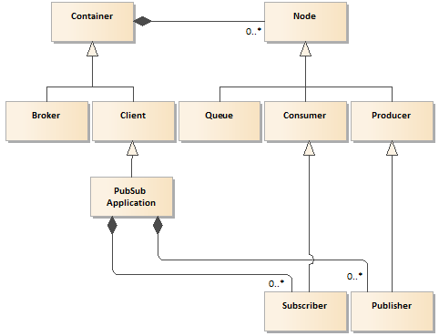

# Underlying Transport over AMQP

## Disclaimer

> **This article is under development and will be subject of further modification after collecting more feedback from software developers and OPC Foundation.** 

## Motivation

The main goal of this document is to provide instruction on how to expand the transport layer for OOI Networking of the **Semantic Data** over the Advanced Message Queuing Protocol \([AMQP][AMQP]\) to be compliant with the specifications mentioned in the section *Normative references*. 

Implementation of the messages exchange over the \([AMQP][AMQP]\) protocol is out of the scope of this project. The library intentionally is designed to use any transport protocol meeting some basic requirements using external components. External components implementing \([AMQP][AMQP]\) connectivity can be seamlessly integrated with this SDK using dependency injection concept illustrated by the following domain model:

Instruction for implementer is covered in the section *Notices for Implementer*.

## Normative references

The following documents, in whole or in part, are normatively referenced in this document and are indispensable for its application.

- [ISO/IEC 19464:2014: Advanced Message Queuing Protocol (AMQP) v1.0][ISO.AMQP]
- [OPC Unified Architecture Specification Part 14: PubSub Release 1.04 February 06, 2018][OPC.UA.PubSub]

## Introduction

### AMQP

The [Advanced Message Queuing Protocol (AMQP)][ISO.AMQP] is an open standard application layer protocol. It is a vendor-neutral and platform-agnostic protocol that offers organizations an easier, more secure approach to passing real-time data streams and business transactions. The goal of AMQP is to ensure information is safely and efficiently transported between applications, among organizations, across distributed cloud computing environments, and within mobile infrastructures. AMQP avoids proprietary technologies, offering the potential to lower the cost of enterprise middleware software integration through open interoperability.

This section briefly summarizes the core concepts of the AMQP and explains how to use AMQP as the transport layer **PubSub Applications**. The goal is for any developer using any existing AMQP 1.0 client stack to be able to provide external, composable implementation of the **MessageHandling** (figure above) class laveraging interoperability via AMQP.

In this section, it is assumed that the management of AMQP communication are handled by a respective stack, such as [AMQP.NET Lite][AMQP.NET Lite], [RabbitMQ][RabbitMQ].

An AMQP network consists of **Nodes** connected via links. **Nodes** are named entities responsible for processing of process data transfered by messages. Messages can originate from, terminate at, or be relayed by nodes. As a message travels through an AMQP network, the responsibility for safe storage and delivery of the message is transferred between the **Nodes** it encounters.

A link is a unidirectional route between two **Nodes**. A link attaches to a node. There are two kinds of nodes: sources and targets. Messages only travel along a link if they meet the entry criteria at the source.

As illustrated in the following domain model, **Nodes** exist within a **Container**. **Container** may be implemented as a process carrying out a software program instance. Examples of containers are **Broker** and **Client** applications. An example of the **Clint** is **PubSub Application**. Each **Container** may hold many nodes. Examples of AMQP **Nodes** are **Producer**, **Consumer**, and **Queue**. **Producers** and **Consumers** are the elements within an application that generate and process messages. **Queues** are entities that store and forward messages.

In order for communication to occur between **Nodes** in different **Containers** a connection needs be established. An AMQP connection consists of a full-duplex, reliably ordered sequence of frames. A frame is a stream of bytes carried on the wire. Connections have a negotiated maximum frame size (length of the stream). It is assumed that connections are transient and can fail for a variety of reasons resulting in the loss of an unknown number of frames.
 
The network connection is thus anchored on the **Container**. It is initiated by the **Container** in the client role making an outbound TCP socket connection to a container in the listener role. Listener role can be used to build applications such as P2P service, router, broker and more. The connection handshake includes:

- negotiating the protocol version; 
- declaring or negotiating the use of Transport Level Security (TLS/SSL), 
- an authentication/authorization handshake at the connection scope that is based on Simple Authentication and Security Layer (SASL).

After the connection is established, the containers each declare the maximum frame size they are willing to handle, and after an idle timeout they will unilaterally disconnect if there is no activity on the connection. 

Security with AMQP is primarily provided by a TLS connection between the **Containers**. Applications that require end-to-end security with AMQP need to apply security protection defined above the AMQP, e.g. in the [OPC.UA.PubSub][OPC.UA.PubSub].

A session forms a bi-directional communication path. Number of sessions must be defined or arbitrary limited.

> Connections, channels, and sessions are ephemeral. If the underlying connection collapses they must be reestablished.

Sessions provide a flow control scheme based on the number of frames transmitted. Since frames have a maximum size for a given connection, this provides flow control based on the number of bytes transmitted. A single connection may have multiple independent sessions active simultaneously, up to the negotiated limit.

A link endpoint is associated with a session endpoint. Within a session, the link is used to transfer messages across them. A single session can be simultaneously associated with any number of links. However, a link has not to be attached to more than one session at a time.

> Links are named, and the state at the node can live longer than the connection on which they were established. A link is unidirectional. A link is created in a session, identified by a unique name, and attached to a node specified by an address. The link is created inside an AMQP Session and, thanks to the multiplexing feature of AMQP protocol, the same session can be used for many links all inside the same TCP connection.

Once attached, a link is subject to flow control of message transfers. Link endpoints maintain the flow control state, which determines when it is legal to send transfers on an attached link.

A source can restrict the messages transferred from a source by specifying a filter. A filter can be thought of as a function which takes a message as input and returns a boolean value: true if the message will be accepted by the source, false otherwise. A filter must not change its return value for a message unless the state or annotations on the message at the node change (e.g., through an updated delivery state).

The AMQP message consists of the following sections:

- Zero or one `header`: the Transport headers for a message.
- Zero or one `delivery-annotations`: delivery-specific non-standard properties at the head of the message.
- Zero or one `message-annotations`: properties of the message which are aimed at the infrastructure and should be propagated across every delivery step.
- Zero or one `properties`: immutable properties of the message.
- Zero or one `application-properties`: structured application data. Intermediaries can use the data within this structure for the purposes of filtering or routing.
- The `body` (`application-data`): consists of one of the following three choices:
  - one or more `data`: contains opaque binary data. 
  - one or more `amqp-sequence`: a sequence section contains an arbitrary number of structured data elements. 
  - a single `amqp-value`: contains a single AMQP value.
- Zero or one `footer`: details about the message or delivery which can only be calculated or evaluated once the whole bare message has been constructed or seen (for example message hashes, HMACs, signatures and encryption details).

> Not all fields are exposed in the library API of the AMQP stack.

The `properties` section is used for a defined set of standard properties of the message. The properties section is part of the bare message; therefore, if retransmitted by an intermediary, it must remain unaltered.

The `application-properties` section is a part of the bare message used for structured application data. Intermediaries
can use the data within this structure for the purposes of filtering or routing.

### OPC UA PubSub

The [OPC.UA.PubSub][OPC.UA.PubSub] offers the publish/subscribe communication pattern as an option to client-server pattern. The detailed description of the [OPC.UA.PubSub][OPC.UA.PubSub] has been covered by the document [OPC Unified Architecture Part 14: PubSub Main Technology Features][README.PubSubMTF].

Among others, the specification recognizes the following actors (see figure above) as parts of the **PubSub Application** as the communication parties: 

* **Publisher**: is the actor that pushes `NetworkMessage` structures to a selected AMQP **Node**.
* **Subscriber**: is the actor that consumes data encapsulated by the `NetworkMessage` structure, which is polled from the selected AMQP **Node**.

According to the specification the **Publisher** and **Subscriber** don't have any subscriptions management functionality, namely, they follow a communication paradigm called unsolicited notification. When unsolicited notification occurs, a client may receive a message that it has never requested. The **Subscriber** must use a filtering mechanism to process only messages it is interested in.

Lack of subscriptions management functionality defined by the [OPC.UA.PubSub][OPC.UA.PubSub] could be mitigated by applying the \( [AMQP][AMQP] \) that some functionality related to communication reliability, data selection, and distribution is delegated to the AMQP **Container**.

## AMQP mapping

### Introduction

Using AMQP connectivity as the messages transport layer by the **PubSub Application** requires two kinds of parameters:

- PubSub **Distribution channel**: promoting interoperability between **Publisher** and all **Subscribers** interested to obtain data from it.
- AMQP connections: Promoting interoperability between **PubSub Application** hosted by an AMQP **Container** and all the AMQP **Containers** that take part in the communication.

Configuration of the parameters related to **PubSub Applications** and AMQP **Containers** interconnection may be recognized as the implementation details except the scenario where remote configuration using **Configuration Management** is the case \( [PubSub Main Technology Features][README.PubSubMTF] \).

### PubSub **Distribution channel**

#### `properties` and `application properties`

The `properties` and `application properties` sections are part of the AMQP `Bare Message`.

[OPC.UA.PubSub][OPC.UA.PubSub] specification defines two possible encoding for the `NetworkMessage` structure and is encoded depending on the selected encoding mapping as defined for the:

- JSON message mapping - The corresponding value of the `content-type` is `application/json`.
- UADP message mapping - The corresponding of the `content-type` is `application/opcua+uadp`. 

#### `data`

The `data` section is part of the AMQP `Bare Message` and is contained in the `body` section. The `data` section shall be used to transfer the `NetworkMessage`.

For UADP message mapping if the AMQP frame size exceeds the **Container** limits it shall be broken into multiple chunks.

The implementation choses packet and message size limits depending on the capabilities of the operating system or the capabilities of the device the application is running on.

> MP NOTE It has been be reported to OPCF:
> The PubSub specification says `AMQP Brokers have an upper limit on message size. The mechanism for handling `NetworkMessage` that exceed the Broker limits depend on the encoding.` Unfortunately, it is not clear which one limit is referred to: ` 
>
> - `max-message-size`: the maximum message size supported by the link endpoint;
> - `max-frame-size`: connection maximum frame size defined in the `open` performative;
>
> The **Broker** role is not defined in the AMQP specification. It is only an example of the **Container** 
>
> TBD: How the more flag of the transfer performative shall be used. `2.6.14 Transferring Large Messages` shall be applied.

 
> MP NOTE It has been be reported to OPCF:
>
>For UADP encoding the specification requires:
>
> It is recommended that the MetaDataQueueName as described in 6.4.2.3.6 is configured as a sub-topic of the related QueueName with the name $Metadata.
>
> Unfortunately the AMQP does not define the terms: 'sub-topic' and QueueName. It is also not clear if `$Metadata` is terminal symbol or refers to somethings else.

> MP NOTE: For MQTT the following limitation is stated: `The messages sent through MQTT are limited to one per Application Message`, but for AMQP it is not present. 

### `properties`

The table below describes how Immutable properties of the message are populated when an AMQP message is constructed.

Field Name   |	Source
-            | -
message-id	 | A globally unique value created by the DataSetWriter.
subject	     | Valid values are `ua-data` or `ua-metadata`.
content-type | MIME type for the message body. MIME types are specified in the message body subsections.
- `subject`: defines the type of the message contained in the AMQP body. A value of `ua-data` specifies the body contains a UADP or JSON `NetworkMessage`. A value of `ua-metadata` specifies a body that contains a UA Binary or JSON encoded DataSetMetaData Message. 
- content-type: specifies whether the message is binary or JSON data.

> MP NOTES: 
>
> The AMQP message properties shall include additional fields defined on the WriterGroup or DataSetWriter through the KeyValuePair array in the WriterGroupProperties and DataSetWriterProperties. The NamespaceIndex of the QualifiedName in the KeyValuePair shall be 0 for AMQP standard message properties. The Name of the QualifiedName is constructed from a message prefix and the AMQP property name with the following syntax.
>
> AMQP defines two kinds of properties :
>  - 3.2.4 Properties: Immutable properties of the message
>  - 3.2.5 Application Properties: Intermediaries can use the data within this structure for the purposes of filtering or routing. The **PubSub Application** cannot be recognized as the intermediary. 

### AMQP connection

#### Addressing

The syntax of the AMQP transporting protocol URL used has the following form:

`amqps://<domain name>[:<port>][/<path>]`

The default port is 5671.

The syntax for an AMQP URL over Web Sockets has the following form:

`wss://<domain name>[:<port>][/<path>]`

The default port is 443.

#### Authentication 

Authentication shall be performed according to the configured `AuthenticationProfileUri` of the `PubSubConnection`, `DataSetWriterGroup`, `DataSetWriter` or `DataSetReader` entities. If no authentication information is provided in the form of `ResourceUri` and `AuthenticationProfileUri`, SASL Anonymous is implied. If the authentication profile specifies SASL PLAIN authentication, a separate connection for each new Authentication setting is required.

> MP NOTE:
> 
>This requirements are not clear because it is not related to Publisher/Subscriber interoperability- it is not common knowledge necessary to communicate over AMQP. This parameter could be relevant for the **PubSub Application** and **Container** interoperability. This section must be revisited after getting more. 
 
#### `Quality of Service`

A writer negotiates the delivery guarantees for its link using the snd-settle-mode settlement policy (settled, unsettled, mixed) it will use, and the desired rcv-settle-mode (first, second) of the broker. 

Vice versa, the reader negotiates delivery guarantees using its rcv-settle-mode (first, second) and the desired snd-settle-mode (settled, unsettled) of the broker.

This matches to the `BrokerTransportQualityOfService` values as follows:

- AtMostOnce_1 – messages are pre-settled at the sender endpoint and not sent again. Messages may be lost in transit. This is the default setting.
- AtLeastOnce_2 – messages are received and settled at the receiver without waiting for the sender to settle.
- ExactlyOnce_3 – messages are received, the sender settles and then the receiver settles.

> MP Note:
>
> This mapping requirements must be reviewed against AMQP specification. It seems that the `BrokerTransportQualityOfService` is defined by the configuration model and not exist if this model is not used.

#### `Keep Alive`

If the `KeepAliveTime` is set on a `WriterGroup`, a value slightly higher than the configured value of the group should be used as idle timeout of the connection ensuring that the connection is disconnected if the keep alive message was not sent by any writer. Otherwise, if no `KeepAliveTime` is specified, the implementation should set a reasonable default value.

> MP NOTE
> 
> It must be explained what the connection means. The AMQP define connection for: 
> - **Containers**, 
> - session 
> - Link.

When setting the maximum message sizes for the Link, the `MaxNetworkMessageSize` of the PubSubGroup shall be used. If this value is 0, the implementation chooses a reasonable maximum.

Other limits are up to the implementation and depend on the capabilities of the OS or or the capabilities of the device the Publisher or Subscriber is running on, and can be made configurable through configuration model extensions or by other means.

> this setting is related to the **PubSub Application and **Container** interoperability except the scenario where the **Subscriber** is implemented as **Container**.

## Notices for Implementer

In the article [Networking of SemanticData Library](README.MD#message-transport) the section *Message Transport* contains description covering instruction for the external AMQP handling components. An example how to implement the Transport layer over the UDP protocol is illustrated by the project [UA Data Example Application](../ReferenceApplication/README.MD).

## See also

[ISO.AMQP]: https://www.iso.org/standard/69466.html

- [OASIS Advanced Message Queuing Protocol (AMQP) Version 1.0][AMQP]

[AMQP]: http://docs.oasis-open.org/amqp/core/v1.0/os/amqp-core-overview-v1.0-os.html
[ISO.AMQP]: https://www.iso.org/standard/64955.html
[OPC.UA.PubSub]: https://opcfoundation.org/developer-tools/specifications-unified-architecture/part-14-pubsub/
[OPC.UA.Profiles]: https://opcfoundation.org/developer-tools/specifications-unified-architecture/part-7-profiles/
[README.PubSubMTF]:../SemanticData/README.PubSubMTF.md
[AMQP.NET Lite]: https://github.com/Azure/amqpnetlite
[RabbitMQ]: https://www.rabbitmq.com/

