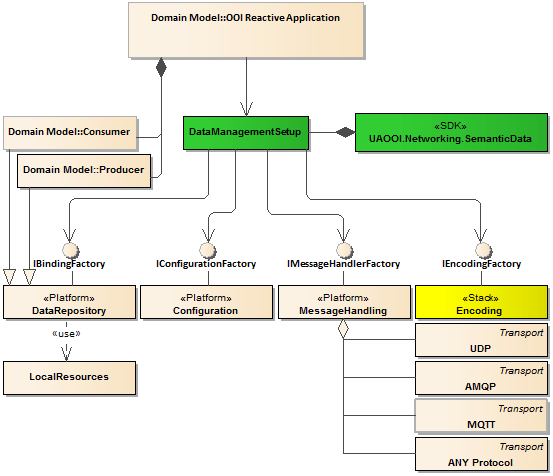

# Underlying Transport over MQTT
 
## Motivation

The main goal of this document is to provide instruction on how to expand the transport layer for OOI Networking of the **Semantic Data** over the Message Queue Telemetry Transport \([MQTT][MQTT]\) to be compliant with the specifications mentioned in the section *Normative references*. 

Implementation of the `Messages` exchange over the MQTT protocol is out of the scope of this project. The library intentionally is designed to use any transport protocol meeting some basic requirements using external components. External components implementing MQTT connectivity can be seamlessly integrated with this SDK using dependency injection concept illustrated by the following domain model:

Instruction for implementer is covered in the section *Notices for Implementer*. 

## Normative references

The following documents, in whole or in part, are normatively referenced in this document and are indispensable for its application.

- \[MQTT\] [ISO/IEC 20922:2016: Message Queuing Telemetry Transport (MQTT) v3.1.1][ISO.MQTT]
- \[OPC.UA.PubSub\] [OPC Unified Architecture Specification Part 14: PubSub Release 1.04 February 06, 2018][OPC.UA.PubSub]

## Introduction

### MQTT

The Message Queue Telemetry Transport \([MQTT][MQTT]\) is an open standard application layer protocol. It is a `Client`/`Server` publish/subscribe messaging transport protocol. The protocol runs over TCP/IP, [WebSocket](http://www.ietf.org/rfc/rfc6455.txt) or over other network protocols that provide ordered, lossless, bi-directional connections. According to the specification its features include:

* Use of the publish/subscribe message pattern which provides one-to-many message distribution and decoupling of applications.
* A messaging transport that is agnostic to the content of the payload. 
* A small transport overhead and protocol exchanges minimized to reduce network traffic.
* A mechanism to notify interested parties when an abnormal disconnection occurs.

The [MQTT][MQTT] protocol defines a binary protocol used to send and receive `Application Message`. The `Application Message` is the data carried by the protocol across the network for the application. When `Application Messages` are transported they have an associated `Quality of Service` (`QoS`) and a `Topic Name`. `Topic Name` is the label attached to an `Application Message` which is matched against the `Subscriptions` known to the `Server`. The `Server` sends a copy of the `Application Message` to each Client that has a matching `Subscription`.

`Server` (called also a broker) acts as an intermediary between `Clients` which publish `Application Messages` and `Clients` which have made `Subscriptions`. The `Server`:

* Accepts `Network Connections` from `Clients`.
* Accepts `Application Messages` published by `Clients`.
* Processes subscribe and unsubscribe requests from `Clients`.
* Forwards `Application Messages` that match `Client` `Subscriptions`.

A `Server` may persist `Application Messages` so they can be delivered even if the `Subscriber` is not online. 

`Client` establishes the `Network Connection` to the `Server`. It can:

* Publish `Application Messages` that other `Clients` might be interested in.
* Create `Subscription` to request `Application Messages` that it is interested in receiving.
* Unsubscribe (dispose of `Subscription`) to remove a request for `Application Messages`.
* Disconnect from the `Server`.

A `Subscription` comprises a `Topic Filter` and a maximum `QoS`. A `Subscription` is associated with a single `Session`. A `Session` can contain more than one `Subscription`. Each `Subscription` within a `Session` has a different `Topic Filter`. `Topic Filter` is an expression contained in a `Subscription`, to indicate an interest in one or more topics. A `Topic Filter` can include wildcard characters.

The session is a stateful interaction between a `Client` and a `Server`. Some `Sessions` last only as long as the `Network Connection`, others can span multiple consecutive `Network Connections` between a `Client` and a `Server`.

The interaction between the `Client` and `Server` is controlled using `Control Packet`. The `Control Packet` is a packet of data that is sent across the `Network Connection`. The specification defines fourteen different types of `Control Packet`, one of which (the PUBLISH packet) is used to convey `Application Messages`.

The [MQTT][MQTT] defines three `Quality of Service` (`QoS`) levels for `Application Messages` delivery:

* "At most once", where messages are delivered according to the best efforts of the operating environment. Message loss can occur. This level could be used, for example, with ambient sensor data where it does not matter if an individual reading is lost as the next one will be published soon after.
* "At least once", where messages are assured to arrive but duplicates can occur.
* "Exactly once", where message are assured to arrive exactly once. This level could be used, for example, with billing systems where duplicate or lost messages could lead to incorrect charges being applied.

The connection has `Keep Alive` attribute. It is a time interval measured in seconds and expressed as a 16-bit word. It is the maximum time interval that is permitted to elapse between the point in time at which the Client finishes transmitting one `Control Packet` and the point it starts sending the next. It is the responsibility of the `Client` to ensure that the interval between `Control Packets` being sent does not exceed the `Keep Alive` value.

The specification introduces a concept of topic levels. The topic level separator is used to introduce structure into the `Topic Name`. If present, it divides the `Topic Name` into multiple topic levels. A `Subscription’s` `Topic Filter` can contain special wildcard characters, which allow `Client` to subscribe to multiple topics at once.

### OPC UA PubSub

The [OPC.UA.PubSub][OPC.UA.PubSub] offers the publish/subscribe communication pattern as an option to client-server pattern and is a consistent part of the OPC UA specifications suit. The detailed description of the [OPC.UA.PubSub][OPC.UA.PubSub] has been covered by the document [OPC Unified Architecture Part 14: PubSub Main Technology Features][README.PubSubMTF].

The specification defines the following actors: 

* `Publisher`: is the actor that pushes `NetworkMessage` structures to an underlying transport layer.
* `Subscriber`: is the actor that consumes data encapsulated by the `NetworkMessage` structure, which is polled from the underlying transport layer.

According to the specification the `Publisher` and `Subscriber` don't have any subscriptions management functionality, namely, they follow a communication paradigm called unsolicited notification. When unsolicited notification occurs, a client receives a message that it has never requested. The `Subscriber` must use a filtering mechanism to process only messages it is interested in.

Lack of subscriptions management functionality defined by the [OPC.UA.PubSub][OPC.UA.PubSub] could be mitigated by applying the [MQTT][MQTT] that some functionality related to communication reliability, data selection, and distribution is delegated to the `Server`.

## MQTT mapping.

### `Application Message` encoding

The [OPC.UA.PubSub][OPC.UA.PubSub] specification defines two possible encodings for the `Application Messages`:
- Binary.
- JSON.

[MQTT][MQTT] does not provide a mechanism for specifying the encoding of the `Application Message` which means the [OPC.UA.PubSub][OPC.UA.PubSub] `Subscriber` entities shall be configured in advance with knowledge of the expected encoding. `Publisher` entities should only publish `NetworkMessages` using a single encoding to a unique MQTT `Topic Name`.

The messages sent through MQTT are limited to one per `Application Message`. It is expected that the software used to receive the message can process it without needing to know that it was transported via MQTT instead of UDP for example.

If the encoded MQTT message size exceeds the `Server` limits it should be broken into multiple chunks as described in the [OPC.UA.PubSub][OPC.UA.PubSub] Specification.

It is recommended that the MetaDataQueueName as described in [OPC.UA.PubSub][OPC.UA.PubSub] is configured as a sub-topic of the related `QueueName` with the name `$Metadata`. The MQTT RETAIN flag shall be set for metadata messages.

The implementation choses packet and message size limits depending on the capabilities of the operating system or the capabilities of the device the application is running on. They can be made configurable through configuration model extensions or by other means.

### Security

Security with MQTT is primarily provided by a TLS connection between the `Client` and the `Server`, however, this requires that the `Server` must be trusted. For that reason, it may be necessary to provide end-to-end security. Applications that require end-to-end security with MQTT need to use the binary message encoding and apply security protection defined in the [OPC.UA.PubSub][OPC.UA.PubSub] specification. 

### Addressing

The syntax of the MQTT transporting protocol URL used has the following form:

`mqtts://<domain name>[:<port>][/<path>]`

The default port is 8883.

The syntax for an MQTT URL over Web Sockets has the following form:

`wss://<domain name>[:<port>][/<path>]`

The default port is 443.

### `Keep Alive`

If the `KeepAliveTime` is set on a `WriterGroup`, a value slightly higher than the configured value of the group in seconds should be set as MQTT `Keep Alive` ensuring that the connection is disconnected if the keep alive message was not sent by any writer in the specified time.

### `Quality of Service`

The `BrokerTransportQualityOfService` values map to MQTT `Quality of Service` settings as follows:

- AtMostOnce_1 is mapped to MQTT QoS 0.
- AtLeastOnce_2 is mapped to MQTT QoS 1.
- ExactlyOnce_3 is mapped to MQTT Qos 2.

## Notices for Implementer

In the article [Networking of SemanticData Library](README.MD#message-transport) the section *Message Transport* contains description covering instruction for the external MQTT handling components. An example how to implement the Transport layer over the UDP protocol is illustrated by the project [UA Data Example Application](../ReferenceApplication/README.MD). This application uses two implementations of the `IMessageHandlerFactory`:

* `ConsumerMessageHandlerFactory` - to create communication infrastructure for the consumer role
* `ProducerMessageHandlerFactory` - to create communication infrastructure for the producer role

It has been implements by the following classes providing the required interfaces:

* `BinaryUDPPackageReader` - implements `IMessageReader` inheriting from `BinaryDecoder`
* `BinaryUDPPackageWriter` - implements `IMessageWriter` inheriting from `BinaryEncoder`

## See also

-  [ISO/IEC 20922:2016: Message Queuing Telemetry Transport (MQTT) v3.1.1][ISO.MQTT]

[MQTT]:http://docs.oasis-open.org/mqtt/mqtt/v3.1.1/mqtt-v3.1.1.html
[ISO.MQTT]: https://www.iso.org/standard/69466.html

[OPC.UA.PubSub]:https://opcfoundation.org/developer-tools/specifications-unified-architecture/part-14-pubsub/
[OPC.UA.Profiles]:https://opcfoundation.org/developer-tools/specifications-unified-architecture/part-7-profiles/
[README.PubSubMTF]:../SemanticData/README.PubSubMTF.md
