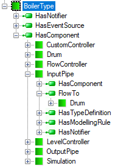
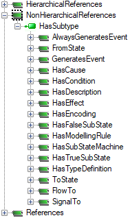
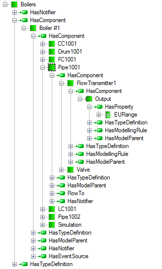

# `ReferenceApplication` Producer - Boilers Set Simulator

## Introduction

The project `Networking.Simulator.Boiler` is a part of the proof of concept with the aim of verifying that the reactive communication implemented using the `Networking.SemanticData` library is well suited to deploy Internet of Things (IoT) paradigm for highly distributed applications. A set of unmanned boilers spread geographically, which have to be monitored and remotely controlled is used as an example in this proof of concept. It is assumed that they produce a lot of process data describing the state and behavior of each boiler. In case some alarms have been raised a serviceman must be called to investigate and fix the problem. So we are facing the following problems:

- **Mobility** – the serviceman must be informed in any localization in the service area (say agglomeration)
- **Navigation** – the serviceman must be routed from the place currently he is to the affected area
- **Remote control** – the serviceman must be able to control remotely the industrial object (in this case the boiler) to avoid any catastrophic behavior
- **Data reusability** – the data must be also available and shared by others helping him minimize danger and fix the problem in the shortest possible time

The main goal of this proof of concept is to demonstrate the feasibility of process data generation and publication using **PubSub** reactive networking concept against selected OPC UA Information Model. It also demonstrates how to design the pluggable software module dedicated to implementing the **Producer** role that is developed solely on top of the library  [Reactive Networking of SemanticData Library](../../Networking/SemanticData/README.MD).

By design it is composable component of the [`ReferenceApplication`](../../Networking/ReferenceApplication/README.MD). This component may be integrated with the `ReferenceApplication` as the `Producer`.

The source code of the OPC UA Information Model is added to the project and is located in the folder 'UAInformationModel'. The folder also contains the solution file that can be opened using the Address Space Model Designer [\[ 2\]][CAS.ASMD]. A detailed description of the OPC UA Information Model deployment is covered in [\[1\]][CAS.OPCUAIMD].

## Informal Model of Boiler

This example considers a real process in a boiler producing steam from water. The piping and instrumentation diagram (P&ID) in Figure 1 shows the piping and process equipment together with the instrumentation and control devices. It consists of an input pipe feeding water, a boiler drum producing steam that is carried away by an output pipe. To meet the process requirements, flow and level controllers use a valve on the input pipe to control water flow in the feedback loop.

Figure 1 Boiler P&ID diagram

## OPC UA Information Model of Boiler

One purpose of this example is to illustrate modeling against OPC UA Information Model . A simplified model of the presented process is illustrated in Figure 2 showing part of an OPC UA Information Model where the `BoilerType` type is defined.

Figure 2 Boiler simplified model

Objects of this type are complex and consist of the following components: `InputPipe`, `Drum`, `OutputPipe`, `FlowController`, `LevelController`, `CustomController`. For all of these objects corresponding types are defined.

To reflect the process behavior, a `FlowTo` reference type is used to interconnect relevant objects and provide clients short browsing paths. It is derived from `NonHierarchicalReferences` (Figure 3) what is exposed in the Address Space of the server. It is good illustration how the requirements that server should expose the OPC UA Information Model are realized in the practice, i.e. the server exposes the types as nodes using predefined layout merging all selected Information Model domains. It is also worth noting that we can find the same type definition in many places in the Address Space (e.g. Figure 2 , Figure 3 , and Figure 4 ).

The `BoilerType` can be instantiated every time a new boiler process is to be represented. As a result of instantiation of this type, all mandatory node chains referenced consecutively by the `HierarchicalReferences` in the forward direction (i.e. all components defined in Figure 2 and all their subcomponents) are instantiated as well.

Analyzing the whole process model is impractical here. To illustrate the design practice using this model, we will focus only on one selected brand of type definition inheritance hierarchy (see Figure 4). The whole model is added to the project and is located in the folder 'UAInformationModel'. The folder also contains the solution file that can be opened using the Address Space Model Designer [\[ 2\]][CAS.ASMD].

Figure 3  New FlowTo reference type definition

The model of the `BoilerInputPipeType` consists of two mandatory object components: `FlowTransmitter1`(`FTC001`) and `Valve`(`Valve001`) (Figure 5). After parent type instantiation, they are also created as components of that type and, therefore, called instance declaration. The newly created nodes have the same browse names (`FTC001`, `Valve001`) and display names (`FlowTransmitter1`, `Valve`) as in the type definition. Since browse names shall be unique in the context of the parent type definition, new nodes may be created without any fear of breaking the browse path uniqueness rules. A graphical element programmed against the `BoilerType` may need to display the value of the `Valve`. If the main graphical element is called `Boiler1` (an instance of `BoilerType`) it will need to refer to the target using the browse path: `Boiler1.Pipe001.Valve001`. This browse path is always unique, because the browse name of the created main object should be unique in the context it is located in and all instance declarations should have unique browse names in the context of types they are defined by.

Figure 4 Model of the BoilerInputPipeType inheritance hierarchy

`FlowTransmiter1` is of `FlowTransmitterType` type, which indirectly inherits from `GenericSensorType`, based finally on the standard `BaseObjectType`. `GenericSensorType` has a component, namely an `Output` variable of the standard `AnalogItemType`, which has three properties: `EURange`, `InstrumentRange` and `EngineeringUnits`, but only `EURange` is mandatory. `InstrumentRange` and `EngineeringUnits` are optional, therefore should be created if needed. In the case of optional instance declaration, clients are responsible for examining the exposed Address Space to check if the predefined nodes are instantiated.

## OPC UA Address Space of `BoilersArea`

After instantiation of the `BoilerType` and adding reference to it in the `Objects.BoilersArea` folder, we obtain the Address Space presented in Figure 5 exposed by the server to clients. It should be noted that objects could have names other than in the definition. It is because each node in the Information Model has `DisplayName` attribute that contains the localized name of the node. Clients should use this attribute if they want to display the node name to the user. They should not use the browse name for this purpose. In this example only mandatory nodes have been instantiated.

Figure 5 `BoilersArea` Object exposed by the server

## See also

> - [ 1] [Mariusz Postol. OPC UA Information Model Deployment][CAS.OPCUAIMD]. 2016. Version 1.2, DOI: 10.5281/zenodo.2586616 
> - [ 2] [OPC UA Address Space Model Designer, 2019][CAS.ASMD]
> - [ 3] [OPC UA Information Model How to Create Instances Video][CAS.VideoInstances]

[CAS.ASMD]: http://www.commsvr.com/Products/OPCUA/UAModelDesigner.aspx
[CAS.OPCUAIMD]: http://www.commsvr.com/InternetDSL/commserver/P_DowloadCenter/P_Publications/20140301E_DeploymentInformationModel.pdf
[CAS.VideoInstances]: https://youtu.be/LvGHl-hRwZw
