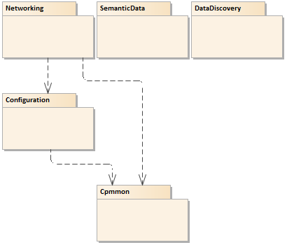

# Object Oriented Internet

## Preface

### What is Object Oriented Internet

In this project, C\# deliverables supporting a new Machine To Machine \(M2M\) communication approach based on the **Data-Oriented Architecture** (DOA) paradigm is to be researched. The goal is to provide a generic solution for publishing and updating information in a context that can be used to describe and discover it by software applications. It is implemented based on the [OPC Unified Architecture](http://goo.gl/y4EHUn) - an industrial integration standard that fulfills the proposed architecture requirements.

The [Object Oriented Internet](https://fedcsis.org/proceedings/2015/pliks/160.pdf) article published in **Proceedings of the Federated Conference on Computer Science and Information Systems** captures description of this idea.

|GoTo| Description|
|:-:|-|
|  | latest release |
|  | the ebook **Object Oriented Internet** contains description of this project - it is autogenerated content gathered from *.md files from this repository. |
|  |join the project chat|
| [10.5281/zenodo.1198852](http://doi.org/10.5281/zenodo.1198852)|you can cite all versions by using the DOI 10.5281/zenodo.1198852. This DOI represents all versions, and will always resolve to the latest one.|

> Note: the DOI number is a unique identifying number associated with the repository version. Visit the section `How to cite the software and associated documentation files` to learn how to create derived works and cite the origin.

### Keywords

> *OPC, OPC UA, M2M communication, Client-Server, Publisher-Subscriber, Data Oriented Architecture, DOA, AMQP, MQTT, PubSub, OPC UA PubSub, Semantic-Data, Industry 4.0, I4.0, Internet Of Things, IoT, IIoT, Global Data Discovery, Security*

### Releases

We use [Semantic Versioning](http://semver.org/) for versioning. For the versions available, see the [releases on this repository](https://github.com/mpostol/OPC-UA-OOI/releases). For your convenience, the versions of the repository and released NuGet packages has been listed in the next subsections.

#### Repository

| Version | Milestone                                                          | DOI |Date|
|:-------:|--------------------------------------------------------------------|:---:|:--:|
|4.0.1 |.NET Standard implementation, documentation improved, new code help documentation available, tested against Xamarin.Android |10.5281/zenodo.2555407 |Feb 1, 2019|
| 3.1.0 |New version of the UAOOI.Networking.ReferenceApplication, documentation has been improved.|10.5281/zenodo.1291549 |Jun 17, 2018|
|3.0.0 |DOI creation for the publication purpose. |10.5281/zenodo.1198853 |Mar 14, 2018|

#### NuGet packages

The table below lists the latest versions of the published NuGet packages.

| Id | Version | Description |
|----|:---------:|-------------|
| [UAOOI.Common.Infrastructure](https://www.nuget.org/packages/UAOOI.Common.Infrastructure) |4.0.1| This library provides API for common infrastructure management functionality aimed at Object Oriented Internet application deployment.)
| [UAOOI.Configuration.Core](https://www.nuget.org/packages/UAOOI.Configuration.Core)| 4.0.1 |The library contains a shared interfaces for server configuration which OPC UA applications can reference. The library provides an abstraction over any OPC UA Server configuration plug-in. Using the library allows an application to indirectly access the server configuration attributes without relying on hard references. The hope is that using this library, third-party applications and frameworks can begin to leverage server configuration management without tying themselves down to a specific implementation.
| [UAOOI.Configuration.DataBindings](https://www.nuget.org/packages/UAOOI.Configuration.DataBindings)| 4.0.1 |OPC UA Object Oriented Internet (UAOOI) DataBindings library is dedicated to create a plug-in aimed at editing of the configuration of any application based on OPC UA Information Model. It allows also to add data binding to the configuration.
| [UAOOI.Configuration.Networking](https://www.nuget.org/packages/UAOOI.Configuration.Networking)| 4.0.1| OPC UA Object Oriented Internet (UAOOI) UAOOI.Configuration.Networking library is dedicated to create a plug-in aimed at provisioning configuration of any application based on OPC UA Information Model.
| [UAOOI.Networking.Core](https://www.nuget.org/packages/UAOOI.Networking.Core)| 4.0.1 | The core functionality of SemanticData Reactive Networking library based on OPC UA Part 14 Pub/Sub.
| [UAOOI.Networking.Encoding](https://www.nuget.org/packages/UAOOI.Networking.Encoding)|4.0.1 | This package provides functionality to lookup a dictionary containing value converters. The interface is used for late binding to inject dependency on the external library.  This library provides IEncodingFactory functionality limited to encoding simple data types only for the testing purpose only.
| [UAOOI.Networking.SemanticData](https://www.nuget.org/packages/UAOOI.Networking.SemanticData) |4.0.1 | SemanticData Reactive Networking library based on OPC UA Part 14 Pub/Sub.
| [UAOOI.Networking.UDPMessageHandler](https://www.nuget.org/packages/UAOOI.Networking.UDPMessageHandler) | 4.0.1 | OOI Reactive Networking: UDP IMessageHandlerFactory Implementation
| [UAOOI.SemanticData.InformationModelFactory](https://www.nuget.org/packages/UAOOI.SemanticData.InformationModelFactory/) | 4.0.1 | OPC UA Information Model Factory Library
| [UAOOI.SemanticData.UANodeSetValidation](https://www.nuget.org/packages/UAOOI.SemanticData.UANodeSetValidation/)| 4.0.1 | This project supports validation of the OPC UA Address Space captured in the XML file against the OPC UA Specification. It is assumed that the Address Space is represented as an XML file compliant with the NodeSet schema. This library is dedicated to creating a plug-in aimed at importing models based on the OPC UA Information Model. It is part of the project supporting OPC UA Object Oriented Internet paradigm.

## Content

### Architecture

The repository workspaces are organized as it is illustrated in the Figure 1 below.

Next sections describe the content of the workspaces in the repository. The workspaces are loosely coupled. Each workspace contains applications (tools), libraries, and unit tests. All common resources are collected in the `CommonResources`.

### Common

This workspace provides API for common infrastructure management functionality aimed at Object Oriented Internet application deployment.

### Configuration

This workspace is aimed at implementing an editor of the `OOI Reactive Application` configuration file. It contains types that supports the configuration management of application implementing the paradigm described in [OOI Semantic Data Processing Architecture](SemanticData/README.MD). The configuration may be read to or write from the xml or json files. By design this library may be used to support variety kinds of applications at design and run time. It supports also the data binding mechanism to define how the process data relate to the real world.

### DataDiscovery

This workspace contains libraries and tools to find the data over the network. In the proposed approach the URI of the OPC UA **Information Model** is to be used as a unique key to browse the **Global Data Discovery System** \(GDDS – an expanded version of GDS\) to find recursively the destination `OPC UA Server`  or  `UA Data Application` exposing the requested data.

To get more details visit the section [Global Data Discovery](./DataDiscovery/README.MD)

### Networking

This workspace contains library empowering the Industrial Internet of Things \(IIOT\) and Industry 4.0. as the result of using reactive networking paradigm. Intentionally it is designed on top of OPC UA Part 14 Pub/Sub protocol supporting interoperability with any product compliant with this specification. Seamless integration with AMQP, MQTT, etc. allows meaningful data transfer in the context of semantics defined using **OPC UA Information Model**.

To get more details visit the section [Internet of Things (IoT) Communication](./Networking/README.MD)

### SemanticData

#### Introduction

The `SemanticData` folder contains projects related to support the [OOI Semantic-Data Processing Architecture](./SemanticData/README.MD). Processing of the OPC UA Data Outside of the Server context is based on the **Semantic-Data** concept. This project is aimed to workout deliverables supporting Process Data handling over Internet including but not limiting to:

- Data edition – UI allowing display and edition of any custom data
- Data serialization and deserialization - see white-paper [Address Space Interchange XML](http://www.commsvr.com/InternetDSL/commserver/P_DowloadCenter/P_Publications/P-150101E-AddressSpaceInterchangeXML.pdf)
- Data prototyping - methods and tools to design custom data types
- Exposition of the process data in the context of metadata [OPC UA Address Space Model Designer](http://www.commsvr.com/Products/OPCUA/UAModelDesigner.aspx)
- Browsing of the Metadata to selectively access requested Process Data
- Modeling and representation of the metadata - see white-paper [OPC UA Information Model Deployment](http://www.commsvr.com/InternetDSL/commserver/P_DowloadCenter/P_Publications/20140301E_DeploymentInformationModel.pdf) 
- Validation of the semantics and consistency of the metadata - see project [USNodeSetValidationUnitTestProject](./SemanticData/UANodeSetValidation/README.MD)
- Data Oriented Architecture (DOA)

#### Project `AddressSpaceComplianceTestTool`

It is command line application aimed to validate XML files compliant with the [UANodeSet schema](https://opcfoundation.org/UA/2011/03/UANodeSet.xsd) defined in Part 6 of the OPC UA Specification. The description of this schema is captured in the document [Address Space Interchange XML](http://www.commsvr.com/InternetDSL/commserver/P_DowloadCenter/P_Publications/P-150101E-AddressSpaceInterchangeXML.pdf)

#### Project `UANodeSetValidation`

The [UANodeSetValidation](./SemanticData/UANodeSetValidation/README.MD) project is a library aimed at validate `UANodeSet` xml files.

To validate a new model add the code to the [USNodeSetValidationUnitTestProject](./SemanticData/Tests/USNodeSetValidationUnitTestProject/README.md) and XML file to the XMLModels in this project. If the validation test does not recognize an error the code in the UANodeSetValidation must be improved.

In this case add issue or modify the code on your fork and add pull request after finishing.

**Public API**:
 The public API for this project is defined by the interface:

- `IAddressSpaceContext`

This interface may be used for dependency injection where validation of the input data conforming to the `UANodeSet` schema is processed.

#### Project `InformationModelFactory`

The project is dedicated to develop the OPC UA Information Model Factory Library. It is a library used as the dependency injection to produce OPC UA **Information Model** by a selected importer. The abstract API must be implemented by a classes providing functionality of **Information Model** creation.

Detailed description is covered by the document [InformationModelFactory Library](./SemanticData/InformationModelFactory/README.md)

## How to cite the software and associated documentation files

To be compliant with the license of the repository the below copyright notice shall be included in all copies or substantial portions of the software and associated documentation files (the "Software").

Copyright (c) 2019 Mariusz Postol

In this section, you will learn how to cite the "Software" using the DOI number. A DOI number is a unique identifying number for the Software version. Because this repository has a DOI, use the DOI in your citation for the article or any derived work, like this:

> Mariusz Postol, Object Oriented Internet: [Target Part Name], `https://github.com/mpostol/OPC-UA-OOI`, [year]
DOI: [10.5281/zenodo.1198852](http://doi.org/10.5281/zenodo.1198852).

or

> Mariusz Postol, Object Oriented Internet: [Target Part Name], `https://github.com/mpostol/OPC-UA-OOI`, [year]
DOI: [http://doi.org/10.5281/zenodo.1198852](http://doi.org/10.5281/zenodo.1198852).

Replace [year] with the current year and [Target Part Name] with the name (or names) of the files you are referring to.

## Conclusion

I hope it is a good place to prototype and converge the OPC UA communication technology with Semantic Data, Industry 4.0, Internet Of Things, Plug and Play, Global Data Discovery, Selective Availability, etc. concepts. My goal is to bridge a gap between OPC UA technology and Industrial IT Application Domains.

The presented approach is a real proposal for a new technology wave based on the existing Internet infrastructure because it allows vendors to provide generic off-the-shelf products tested independently for interoperability.

## Read more

-  ebook **Object Oriented Internet** contains description of this project - it is autogenerated content gathered from *.md files.
- [API Browser](http://www.commsvr.com/download/UAOOI401/index.html)
- The paper [**Object Oriented Internet**](https://fedcsis.org/proceedings/2015/pliks/160.pdf) has been presented on the conference [3rd International Conference on Innovative Network Systems and Applications](https://fedcsis.org/2015/inetsapp).
- [WIKI of this project](https://github.com/mpostol/OPC-UA-OOI/wiki)
- [My Blog: About enablers of future solutions](http://wwww.mpostol.wordpress.com/)
- [About me on LinkedIn](https://pl.linkedin.com/in/mpostol)
- [OPC Foundation](https://opcfoundation.org/)
- [Sponsored by commsvr.com](http://www.commsvr.com/)
- [References](References.md) - this section contains links to selected internal and external resources.

