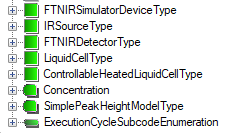

# ADI Information Model Adoption

The main tasks of the ADI Information Model adoption are as follows:

- Model extension by definition of vendor specific types.
- Model customization by overriding components of the existing types.
- Instantiation of all objects making up the ADI compliant Address Space.

The Information Model defined in the ADI specification [[1]][OPC.UA.ADI] is generic, and to expose representative information for a selected analyzer device it must be extended further by defining parameters and/or subtypes derived from the base types provided in this specification. These types can be used to create all objects representing the analyzer device in the Address Space exposed by the UA Server. This process is described in more details in the section Design and Deployment Support). Each analyzer device must be represented in the Address Space by an object of a type indirectly derived from an abstract `AnalyserDeviceType`. Additionally, this object must be interconnected to the standard infrastructure of the Address Space. Many instance declarations in the ADI Information Model are optional or have only meta-definition (e.g. components representing channels); therefore they are not created by default as a result of instantiation of their parent and must be subject of further definition refining.

Extending the ADI Information Model and refining the definitions provided in the specification should allow designers to adjust the Address Space exposed by the UA Server so as to represent truthfully the underlying process.

To create a vendor specific Information Model, usually additional types must be defined. Figure 1 illustrates a set of new types derived indirectly form the AccessoryType. More examples on how to expand the model are described in the specification [[1]][OPC.UA.ADI] and in the [2].

The Information Model representing a device is layered (Figure 2) and, therefore, the question how to distribute definitions among layers must be addressed. According to the best practice rules, the vendor specific part of the Information Model shall be layered as follows:

- Base product type definitions.
- Product models type definitions.
- Instance declaration modifications.

In this simple example no product models are recognized and, therefore, we have no definition on layer 2. According to the above rule the `FTNIR_Simulator` object has been located in the `FTNIRModelInstance` project and all types presented in Figure 1 are provided by the `FTNIRModel` project (Figure 2).

## See also

- [[1] OPC Unified Architecture for Analyzer, OPC Foundation, Rel. 1.1a, 2015-01-09][OPC.UA.ADI]
- [2] Wolfgang Mahnke, Stefan Helmut Leitner, Matthias Damm. OPC Unified Architecture. Berlin: Springer, 2009.

[OPC.UA.ADI]:https://opcfoundation.org/developer-tools/specifications-opc-ua-information-models/opc-unified-architecture-for-analyzer-devices-adi/
