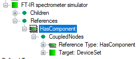
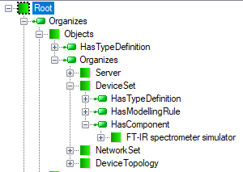
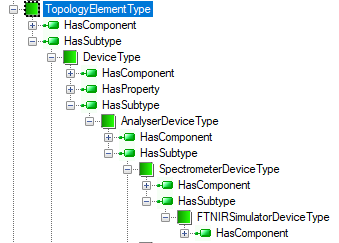
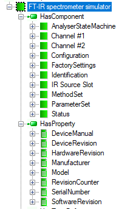

# ADI Model Deployment

Taking into consideration that the browse mechanism is based on the incremental and relative passage along a nodes path, we can easily find out that each path must have a defined entry point, so we must address a question where to start. To meet this requirement, the OPC UA Specifications provide a predefined structure [[2]][OPC.UA.Part5] containing well defined nodes that can be used as anchors to start discovering the Address Space by clients.

Information Model|Address Space
 -|-
 |

For the above example, a typical organization of the UA Server Address Space seen by a client is presented in Figure 2. Two objects can be distinguished in this hierarchy: Objects and `DeviceSet`. The purpose of the Objects is that all objects and variables that are not used for type definitions or other organizational purposes (e.g. organizing the Views) are accessible through hierarchical references starting from this node. `DeviceSet` is an object containing all the devices according to the DI Information Model specification [[1]][OPC.UA.DI].

To locate an object in the nodes layout presented in Figure 2, a `HasComponent` reference must be added to the object FT-IR spectrometer simulator (Figure 1). The `HasComponent` references are used to browse the Address Space from the top toward the bottom, but it is worth noting that in the model this reference is added to the destination node instead (Figure 1). The main reason is to keep the DI model representation invariant. The reference must be added at some point in time during the design phase, i.e. before the Address Space is instantiated. It is one of the main reasons why we need an independent view of the Information Model (planet) and Address Space (created).

The Address Space content exposed by the UA Server can change in time reflecting any change of the underlying process. A good example, where the dynamic content of the Address Space is very useful, is hot-swappable device modules, like accessories. In this case the server must be able to discover the current configuration and instantiate/delete nodes and/or references according to this configuration.

As it was stated above, to create the Address Space, the UA Server needs to instantiate nodes and interconnect them by References. According to the specification requirements, to create the Address Space, any UA Server must instantiate all mandatory objects that organize the Address Space and can be used as entry points to start browsing and discovering it. One of them is Objects (Figure 2) that is the server browse entry point for objects.

Having all objects organizing the Address Space, the UA Server creates instance of objects declared by the custom information model. In the above sample model, the server instantiates FT-IR spectrometer simulator as a component of the `DeviceSet` defined in the `OpcUaDiModel` (Figure 3).

After parent type instantiation, the server creates also all components of that type and all its base type components called instance declaration. This operation is applied recursively. In other words, in order to get full information about a subtype, the inherited instance declarations shall be collected from all types that can be found by recursively following the inverse `HasSubtype` references from the subtype. For the above example, the nodes under the FT-IR spectrometer simulator are a collection of all components (coupled by `HasComponent` reference to the type) traversing the inheritance chain Figure 4:

- `SpectrometerDeviceType` 
- `AnalyserDeviceType`
- `DeviceType`
- `TopologyElementType`
- `BaseObjectType`

The newly created nodes have the same value of the `BrowseName` attribute as in the type definition. Since `BrowseName` values shall be unique in the context of the parent type definition, the new nodes may be created without any fear of breaking the browse path uniqueness rules. This browse path is always unique, because the `BrowseName` of the created main object must be unique in the context it is located in and all instance declarations shall have unique `BrowseName` values in the context of types they are defined by. More detailed discussion on the instance declaration concept can be found in the section Custom Models - Boiler.

The inheritance mechanism and automatic creation of instance declaration cause that the objects in the Address Space exposed by the UA Server may have more components then their type definition. An example is the `FTNIR_Simulator` object (labeled FT-IR spectrometer simulator in Figure 5) with the `DisplayName` from the attribute of type `SpectrometerDeviceType`. The type has only two components: `ParameterSet` and `FactorySettings`, but in the exposed Address Space fragment (Figure 5), the other nodes (except `IRSourceSlot`, `Channel1` and `Channel2`) are created because they are defined as components in one of the basic types making up the inheritance hierarchy (Figure 4).

The instantiation process may be modified by overriding the already defined components in the derived types and by adding new components manually.

`IRSourceSlot`, `Channel1` and `Channel2` are added to the definition of the `FTNIR_Simulator` object (Figure 5).  `IRSourceSlot` is of `AccessorySlotType`, and `Channel1` and `Channel2` are of `AnalyserChannelType`.  All are defined as components of the `AnalyserDeviceType`. The definition of the `AnalyserDeviceType` allows designers to add as many components of the `AccessorySlotType` and `AnalyserChannelType` to the created object as it is necessary to represent the structure of an existing analyzer. `AnalyserDeviceType` defines cardinality 1..* for the channel meta-definition and, therefore, it imposes a limitation that at least one channel must be created. Components of the `AnalyserChannelType` are an example where the basic ADI Information Model must be customized to converge the Address Space with the represented underlying environment.

The properties `SerialNumber`, `RevisionCounter`, `Manufacturer`, `Model`, `DeviceManual`, `DeviceRevision`, `SoftwareRevision` and `HardwareRevision` (Figure 5) are inherited from the `DeviceType` defined by the DI Information Model. Values of these properties can be defined as default values in the model or provided by the equipment at run-time.

A very important `AnalyserStateMachine` component of the FT-IR spectrometer simulator is inherited from `AnalyserDeviceType`. `AnalyserStateMachine` is an object that represents behavior of the analyzer device using the state machine concept. This construct can be used to model discrete object behavior in terms of the states an object can reside in and transitions that can happen between those states.  State machines are built as complex objects using dedicated `ObjectTypes`, `VariableTypes` and `ReferenceTypes`, whose semantics is governed by the rules that must be strictly observed. A state is a condition in which an object can be at some point during its lifetime, for some finite amount of time. A transition is a change of an object from one state (the source state) to another (the target state).  The transition is triggered ("fires") when an event of interest - cause - to a given object occurs. According to the Information Model concept, causes are represented in the form of Methods that shall be called, but a vendor can define other items or have them be internal (i.e. nothing is listed causing the transition). There may also be an action associated with a triggered transition. This action is executed unconditionally before the object enters the target state and effects in the form of Events that are generated.

The `AnalyserDeviceType` is also a source of definition of the Methods exposed by the UA Server (Figure 5). All the methods are collected as components of the `MethodSet` object.

## See also

- [[1 ] Part 100: Device Information Model, OPC Foundation, 1.02, 2019-04-19][OPC.UA.DI]
- [[2] Part 5: Information Model, OPC Foundation, Rel. 1.04, 2017-11-22][OPC.UA.Part5]

[OPC.UA.DI]:https://opcfoundation.org/developer-tools/specifications-unified-architecture/part-100-device-information-model/
[OPC.UA.Part5]:https://opcfoundation.org/developer-tools/specifications-unified-architecture/part-5-information-model/

