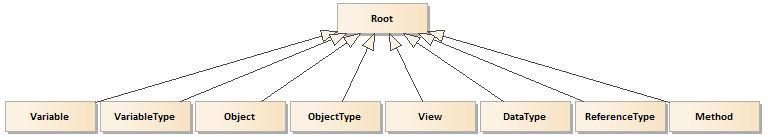

# Address Space and Address Space Model

## Address Space

The primary objective of the OPC UA server is to expose information that can be used by clients to manage an underlying real-time process and the entire enterprise as a large whole with the main challenge of integrating systems and management resources into one homogeneous environment. Information describes the state and behavior of the process and the server must be able to transfer it in both directions. The main challenge of the OPC UA Address Space is to support this transfer in a unique and transparent way in spite of the process complexity and roles of clients in the enterprise management hierarchy.

To make the data available for further processing by computer systems it must be assured that the data is:

- **transferable** – there must exist mechanisms to transfer the data over the network,
- **addressable** – there must exist services to selectively access the data,
- **meaningful** – there must exist rules (unambiguous for all interoperating parties) how to apply the semantics to bit patterns.

OPC UA Address Space concept is all about exposing the data in a standard way, so it must address the above mentioned issues, but the description of mechanisms involved in the data transfer is outside this section scope.

Generally speaking, to select a particular target piece of data we have two options: random access or browsing. Random access requires that the target item must have been assigned a globally unique address and the clients must know it in advance. We call them well-known addresses. The browsing approach means that the clients walk down available paths from entity to entity that build up the structure of data. This process is costly, because instead of jumping to a target, we need to discover the structure of the data step by step using relative identifiers. The main advantage of this approach is that the clients do not need any prior knowledge of the data structure – the clients of this type are called generic clients. To minimize the cost, after having found the target, every access to it can use random access. Random access is possible since the browsing path is convertible to a globally unique address.

It seems that, in spite of the access method, we have to assign an address to all of the accessible items in the representation of the data structure. We therefore call the collection of these items the Address Space [1], [3], [5]. In this concept this atomic addressable item is called a node.  Each node is a collection of Attributes (value-holders) that have values accessible locally in context of the node. To enable browsing, i.e. to represent information about the internal structure, nodes are interconnected by References (address-holders of coupled nodes).

## Address Space Meta Model

The main goal of exposing a network of nodes to clients is to create a meaningful context for the underling process data. To create the Address Space, we need to instantiate nodes and interconnect them by References. Instantiating nodes requires assigning appropriate values to attributes. To make information internally consistent as a large whole, we need rules governing the creation and modification processes, i.e. Address Space Model. According to the model the roles of nodes in the network are well defined as a result of the definition of a set of `NodeClass`es. Available `NodeClass`es are predefined, i.e. the Address Space Model provides a strictly defined and non-extensible set of `NodeClass`es.  Each one is assigned a dedicated function to represent well defined information at run-time. `NodeClass` is a formal description of the node defining the allowed attributes and references. Each node must be an instance of the selected `NodeClass`.

The Address Space Model defines the following set of `NodeClass`es (Figure 1):

- `View`: defines a subset of nodes in the Address Space.
- `Object`:  is used to represent systems, system components, real-world objects and software objects.
- `Variable`: is used as real-time process data holders, i.e. it provides a value.
- `Method`: is a lightweight function, whose scope is bounded by an owning object.
- `ObjectType`: provides definition for objects.
- `DataType`: is used to define simple and complex data types of the Variable values.
- `ReferenceType`: is used to define the meaning of the nodes relationship.
- `VariableType`: is used to provide type definition for variables.

It is worth noting that the `ReferenceType` nodes are visible in the Address Space. In contrast, a reference instance is an inherent part of a node and no `NodeClass` is used to represent references. In other words, any node is a collection of references, so there is no need to instantiate an additional object as reference with the role of a nodes couple.

Accessing information by clients is the first aspect of controlling the information stream between the clients and underling process. Another one is creating and maintaining the Address Space in real-time. This activity includes also creation of data bindings with the underlying real-time process. This topic is described in more details in the section [*Address Space Model Life-cycle*][ASMLC].

The `Variable` node is used to be a holder of the process data – it has a `Value` attribute. To be used as the real-time process state representation, the value of the `Value` attribute must be bound to a real data source, e.g. a sensor or actuator. The `Method` node represents functions that can be called by the clients connected to the server. In this case the real-time process bindings are responsible for conveying the parameters current values, invoking the represented function and returning the execution result. Both classes are the main building blocks that allow the server to couple the exposed address space` with the current state and behavior of the underlying process.

> Add description of all NodeClasses
>

- [Address Space Model Life-cycle][ASMLC]

[ASMLC]:InformationModelLifecycle.md
