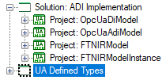
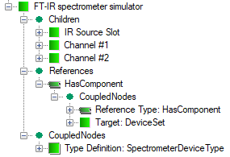

# Design and Deployment Support

## Introduction

Publication of process real-time data and metadata in the Address Space requires a prior model design. From the section *[Address Space Model Life-cycle]*, we can learn that design, development, deployment, and maintenance is a multi-phase engineering process. Moreover, the model deployment varies depending on the server implementation. All of that causes that configuration and process data binding of the server is a complex task and that is why a development environment is required to help architects, engineers, and developers accomplish this task following the best practice rules. This tool should support all aspects of the model deployment process including edition, validation, visualization, data binding definition, and generation of all files allowing the server to expose real-time process data in the context of metadata.

The tool supports all aspects of the model designing process, e.g. easy addition and deletion of nodes from the model structure, definition of nodes relationship and types, nodes filtering, helpful search and find utility, type declaration, etc.

It should implement conceptual containers called solutions and projects (Figure 1 above) to apply its settings. Any solution contains one or more projects and it manages the way the designer configures, builds, and deploys sets of related projects. Any project includes source files containing the model representation and related metadata such as namespace, properties, and references to other projects. While projects are built, output files are produced to be used by the UA Server to expose the designed Address Space (Section *[Address Space and Address Space Model]*).

The OPC UA information modeling (Section *[UA Information Model - Concept]*) concept is based on layers, which step by step expand the basic model provided by the specification [\[2\]][Opc.UA.Part3], [\[3\]][OPC.UA.Part5]. To follow this concept, the design tool uses projects to implement model layers. Projects are related to each other making up a layered hierarchy. Referring to the example of the ADI model and according to this concept, this model domain is one of the layers and is captured by the project OpcUaAdiModel illustrated in Figure 1 above.

The ADI model is located above the DI Information Model (`OpcUaDiModel` in Figure 1 above). It means that the ADI model refers to definitions provided by the DI model, but the reverse is not true. To meet the vendor specific device requirements and further expand the ADI model, the next layers shall be provided. In Figure 1 above project FTNIRModel contains all the type definitions required in this particular example and the project FTNIRModelInstance has an object declaration representing the device.

The model representation contained by the projects is a collection of definitions of types called `NodeClass` and their references, which make up a domain that defines a collection of unique names called namespace. This namespace is identified by a globally unique identifier URI (Uniform Resource Identifier) that has two roles:

- to avoid ambiguity
- to associate a responsible organization for designing and maintenance of that model

The Address Space is a collection of nodes that are instances of predefined types (`NodeClass`). Each `NodeClass` is defined as an invariable set of named attributes and a collection of references that shall be assigned (given) values when the node is instantiated at run-time. The tool must allow designers to add freely definitions of any class defined by the specification to the model tree view (Figure 2 above), i.e. View, Object, Variable, Method, ObjectType, DataType, ReferenceType, and VariableType. Initial values of the attributes can be provided using the property grid pane.

An object of a type derived from the `AnalyserDeviceType` representing the device as a whole is the topmost one in the ADI object model. `AnalyserDeviceType` is an abstract type and, therefore, to create an object of this type it must be subtyped to represent different kinds of analyzer devices. A tree view in Figure 2 above illustrates an example of the FT-IR spectrometer simulator object of the type SpectrometerDeviceType that is to represent an example spectrometer in the Address Space. The definition of this object causes that the UA Server instantiates it and all the mandatory instance declarations (components) while creating the Address Space instance.

Figure 2 above is an example of a graphical representation where the snippet of the model definition is presented as nodes on a tree view. To facilitate organization and definition of relationship some tree items have a special role. The top-level `Domain` node is a container of all the definitions belonging to the namespace represented by the project. Namespaces collect all namespace definitions that the projects refer to.

Each node added to the tree view has also a few dedicated branches being placeholders of special treatment. The main aim of the `Children` tree item is to create “part of” relationship. It is an entry to a branch that collects components, i.e. in the Address Space established by a server all nodes in this branch will have been referenced by the parent using a reference of a type derived from `HasComponent` or `HasProperty`. For example, `Channel1` (Figure 2 above) is a component of the FT-IR spectrometer simulator object and adding it to this container causes that in the established Address Space it will be referenced by the FT-IR spectrometer simulator using `HasComponent` reference. References tree item creates a branch that contains all references of the parent node except the above-mentioned ones. The automatically created `CoupledNodes` tree item is a container of all nodes coupled with the parent, e.g. type definition of the parent node (`HasTypeDefinition`), the target of a reference, etc. This node is used to improve the readability of the model and enhance navigation.

Finally, having designed the model, it must be compiled to provide an `Address Space Model` (Section [Address Space Model Life-cycle]) expected by the UA Server. This operation is partially semi-automatic, but it must be accompanied by the definition of bindings between instantiated nodes in the Address Space and real-time data sources.

In the case of the reference application, the underlying process data bindings are added manually by modification of the auto-generated program source code, and adding behavior necessary for getting access to the data.

For generic solutions, the tool can be provided with an external dedicated component supporting the selected server configuration in the context of the model. The configuration in the context of the model means that the tool offers the possibility of selecting a real-time data source for each instantiated node independently, e.g. selecting a register of the controller or a tag from an OPC DA client subscription.

## Visualization

The tool should offer diverse views, flexible filtering and simulation functionalities to create a customized image of the model most appropriate for the current task to view items and perform item management tasks. These features not only increase the designing process efficiency but also improve the robustness of the process by avoiding unexpected structural errors at the very early development stage.

The model can be visualized using the following modes: Information Model (model) view (2D/3D), Address Space (browse) view (2D). In 2D - OPC UA graphical notation is used, in 3D views - the designer can use scaling, rotating and change the viewpoint to tailor the display to individual needs. A selected node, its properties, and references can be edited using the property pane or custom editors.

## Build support

The building, debugging, and testing activities are the most important for developing and delivering robust UA applications. The tools enable you to identify and resolve errors efficiently and test your model in a variety of ways without the necessity of postponing it up to the UA server development. It, therefore, makes the model designing process completely independent of software development and to be successfully accomplished by real-time process information architects. This tool can be used independently of any UA application development environment, but - to utilize the model - it must be used for instantiating the content of the Address Space by a UA server. The main aim of the tool is to achieve this goal without any programming skills.

## Interoperability without programming

The architecture of the tool allows vendors of the UA servers to develop plug-ins providing a configuration editor. The editor is used to modify the general settings and define model nodes data-bindings with the real-time process. Advantages of this solution are as follows:

- Simple configuration
- No programming skills are required
- An easier way to move your old OPC server to the Unified Architecture world.

## OPC UA E-book

The development environment should also be an intelligent eBook. It contains much useful information about UA specifications, Address Space concept, information model and development of the OPC UA models. What is more, a smart content positioning system of the help window can follow object selections in the GUI. The content of the book is available online so it is continuously improved to follow the specification development progress. This software takes advantage of automatic update functionality. Both those features guarantee that your development environment is always up to date.

Thanks to the intelligent book idea, this tool is very useful not only for OPC UA professionals but also for the beginners who want to learn about the OPC UA address space concept.

## OPC Foundation OPC UA SDK support

OPC Foundation has already released the UA Software Development Kit that is a collection of libraries, applications and source code that allow developers to build OPC UA applications. Any developer who wants to create an OPC UA server of his own has to accomplish many tasks, but one of the most important is preparing of a model. This could be a hard task; OPC Foundation UA SDK does not include any tool, which helps prepare such a model. The model must be made from scratch by editing the XML file. Therefore , the tool must be compliant with this SDK to make the preparation of the XML file much easier task.

## Conclusion

Concluding the above the most important requirements of the development environment may be specified:

- Allows creating, displaying and editing OPC UA models that are compatible with the OPC Unified Architecture address space concept.
- All nodes are presented on a tree and can be edited in the property window.
- Provides the comprehensive intelligent book, the content of which is available online so it is continuously improved and always up to date.
- The whole configuration can be prepared using a user-friendly Windows-based graphical user interface.
- The content smart positioning system allows for providing context-sensitive help.
- No XML file editing is required.
- No programming skills are required.

An example of the tool meeting all this requirements is [OPC UA Address Space Model Designer, 2019][CAS.ASMD].

## See also

- [1] [OPC UA Address Space Model Designer, 2019][CAS.ASMD]
- [2] [OPC Unified Architecture Specification Part 3: Address Space Model, OPC Foundation, Rel. 1.04, 2017-11-22][Opc.UA.Part3]
- [3] [OPC Unified Architecture Specification Part 5: Information Model, OPC Foundation, Rel. 1.04, 2017-11-22][OPC.UA.Part5]
- [4] [Address Space Model Life-cycle]
- [5] [Address Space and Address Space Model]
- [6] [UA Information Model - Concept]

[CAS.ASMD]: http://www.commsvr.com/Products/OPCUA/UAModelDesigner.aspx
[Opc.UA.Part3]:https://opcfoundation.org/developer-tools/specifications-unified-architecture/part-3-address-space-model/
[Opc.UA.Part4]:https://opcfoundation.org/developer-tools/specifications-unified-architecture/part-4-services/
[OPC.UA.Part5]:https://opcfoundation.org/developer-tools/specifications-unified-architecture/part-5-information-model/
[UA Information Model - Concept]:InformationModelConcept.md
[Address Space and Address Space Model]:AddressSpaceAddressSpaceModel.md
[Address Space Model Life-cycle]:InformationModelLifecycle.md
