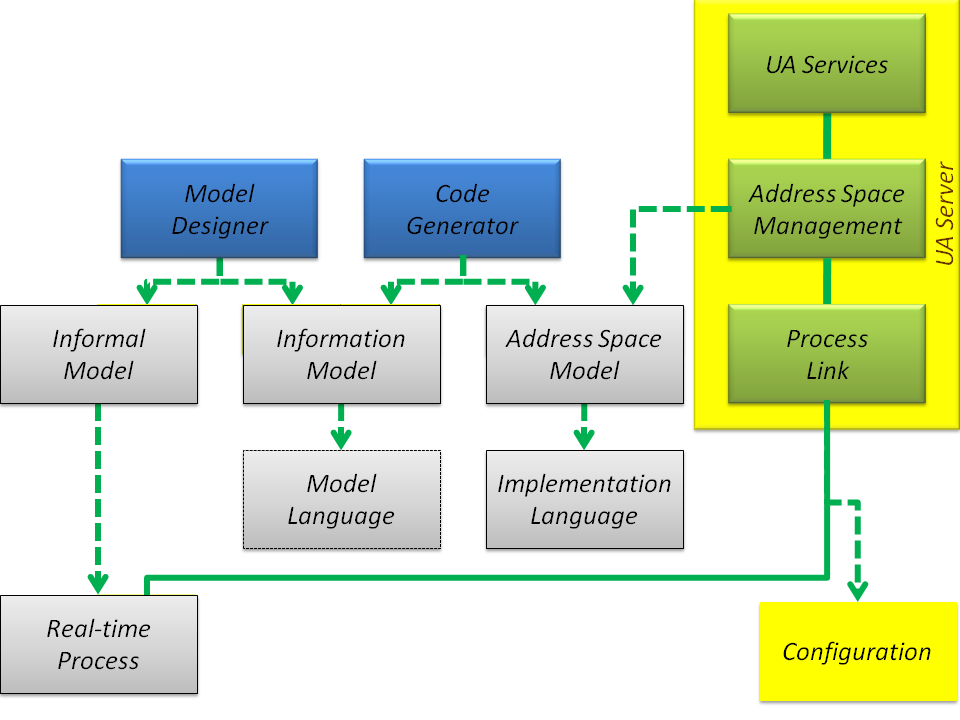

# Address Space Model Life-cycle

The OPC Unified Architecture (UA) is a standard that allows servers to provide process data and environment metadata to clients in a unique and platform-independent way. To meet this objective, at run-time each server instantiates and maintains the address space that is a collection of data to be exposed to clients. The OPC Unified Architecture `Address Space Management` (Figure 1) embeds the address space instance that consists of nodes and references. The main role of the nodes and references is to expose the state and behavior of an underlying process as a graph of nodes.

At run-time typical implementation architecture consists of OPC UA Clients, which are connected to an OPC UA Server. The server exposes process data in the context of the address space instantiated in compliance with the selected `Address Space Model`.

In a typical architecture (Figure 1), exposing the process data in the context of metadata means that information produced by the `Real-time Process` is gathered by the `Process Link` as process data and assigned to `Variable` nodes residing in the address space and maintained by the `Address Space Management`. Next, process data can be accessed and processed by a generic client using `Services`. In a production environment, the `Address Space Model` may be also used offline in clients development or configuration process to offer additional features, namely preconfigured customized control panels, dedicated data visualization panes or predefined structure of the database tables. The model knowledge also simplifies the configuration of clients, because all of the items composing the complex process information can be accessed directly without the necessity to browse the address space graph of nodes.

To implement the `Address Space Management` concept, two questions must be addressed:

- How to create and maintain address space?
- How to bind the `Variable` nodes with the real-time process data sources?

To create the address space instance the `Address Space Management` must instantiate all nodes and interconnect them by means of references. A detailed description of this process is covered by the section: [*Address Space and Address Space Model*][ASASM]. Using the nodes by means of a well-defined set of services [[6]][Opc.UA.Part4], clients get access to data representing the state and behavior of a selected part of the underlying process. In this architecture, the address space plays the role of **process replica**. In this scenario, the server must couple the exposed address space nodes with the current state and behavior of the underlying process. Therefore, to maintain this coupling, there must be established an out-of-band connection to physical devices used to transfer real-time process data in both directions.

The binding technique of nodes and real-time process data are vendor specific. Nodes management functionality on the client part is standardized by the Part 4 – Services of the specification [[6]][Opc.UA.Part4]. Access to the values representing the current process state is provided by the read/write functions. The client can also be informed about changes of the process state using "data change" notifications. Invoke and event notification functionality allow clients to use the methods.

Using the address space concept and using provided `Services` clients can also get access to special kind of process data, i.e. events, alarms, and historical data.

To implement the functionality presented above, we need to use three coupled function classes (Figure 1):

- `Services` - in-band connectivity and data transfer over the network
- `Address Space Management` - address space nodes management and process data cache
- `Process Link` - out-of-band process data transfer, conversion, and binding

The diagram in Figure 1 shows the dependencies and associations between the function classes mentioned above. In this domain model, the `Process Link` is responsible for transferring real-time process data up and down. The embedded address space maintained by `Address Space Management` is a collection of `NodeClass` instances (nodes) (see section [*Address Space and Address Space Model*][ASASM]). Each node is a carrier of values (attributes) and collection of references used to create a nodes graph. `Variable` nodes expose the real-time process data using dedicated `Value` attribute. Other nodes are used to create meaningful context for the process data exposed to all connected clients by the `Services` (Section [*Address Space and Address Space Model*][ASASM]).

Real-time process data is obtained from the underling process devices.  The `Process Link` gets access to it using the out-of-band underlying communication infrastructure and vendor specific protocols. For embedded applications it may use directly internal controller registers of the device instead of transferring the data over a wire.

To create the address space instance - i.e. to instantiate all nodes and interconnect them by means of references - the `Address Space Management` uses a static `Address Space Model` (Figure 1) created in advance and providing a detailed description of all the nodes, including their attributes value and interconnections by means of references. Static means that the model is predefined for the selected environment, but it does not mean that the exposed address space is static at all. In this approach, nodes can be instantiated and linked dynamically, however the process must conform to the meta model definition `Implementation Language`. Dynamic behavior of the address space can be controlled by the connected clients using services or by the current state of the process.

It is worth noting that the `Address Space Model` may be implemented as a set of files created with a variety of purposes. Serialization, data binding, and server configuration are most important. Serialization is a conversion of structured complex data into a stream of bits with the goal of transferring it over the network or storing it using the file system. Data binding is responsible for coupling `Real-time Process` sources with the appropriate nodes in the address space with the result that the content depends on a deployment instance. Usually, the files necessary for the server are created as a result of the compilation process. The main goal of compilation is to apply all of the type definitions to created nodes and bind them to the `Real-time Process` data. Consequently, it is a product of a compiler and because it is intended to be consumed by the server the `Implementation Language` must have a machine-readable syntax.

As it was described in the section [*UA Information Model - Concept*][IMConcept], any model is designed with the goal of formally determining the information that is to be used to describe the `Real-time Process` state and its behavior. It is human-centric process and is accomplished by the definition of types. This way we can create autonomous, deployment independent, reusable definitions. The main challenge is to obtain an appropriate level of model simplicity. At the same time, it is worth noting that simplicity is not born by simplification but is rather a result of abstraction, i.e. while designing a model the `Real-time Process` details should not be neglected but hidden if necessary. The independence and reusability means that the model must not depend on the production environment.
  
Concluding the above discussion, the second step in the address space information model life-cycle is the `Address Space Model` generated in a format to be used as a foundation for nodes instantiation and interconnection them by references. The `Address Space Model` representation is usually generated by a compiler (`Code Generator` on Figure 1) that processes the selected `Information Model` and creates a set of documents containing all information necessary to instantiate and interconnect nodes at run-time by the `Address Space Management` of the `UA Server`. The compiler could be an independent product or it can be embedded into the `UA Server` or `Model Designer`.

The main functions of the compiler are:

- replace the Universal Resource Identifiers (URI) (fully qualified names) by more efficient local identifiers relative to an implementation dependent namespace table used to preserve their aliases
- crate and maintain the namespace table
- process the inheritance chain applying instance declarations
- construct type instances by processing instance declarations and inheritance chains
- validate the model against `Address Space Meta Model` rules (section [*Address Space and Address Space Model*][ASASM])
- validate the model against `Model Language` rules and [*Standard Information Model*][SIM]

From the model developer point of view, the compilation process may be recognized as an obfuscation process making the result hard to read and modify.

Available in the open source domain [OPC UA Information Model Compiler][OPC.UA.ModelCompiler] tool is an example of this kind of tools. As the `Information Model` - an input for compilation process - it uses a set of XML files compliant with the `ModelDesign` schema.  In this case, the `Address Space Model` represents a variety of generated files including XML file compliant with the UANodeSet schema defined in [Part 6][OPC.UA.Part6] of the OPC UA specification. The main purpose of this specification is to provide a standard syntax that designers can use to formally represent their models in a form that can be read by a computer program. Unfortunately, this format is not well suited to be used directly by designers at the very beginning of the information model development and adoption stage. It is also worth stressing that `ModelDesign` schema - a foundation of the `Model Language` - is not formally defined by the OPC UA specification, so must be recognized as a proprietary solution.

Because UANodeSet is standardized it must be considered as the out-of-band interchange format of the models to leverage reusability. In any case that `Informal Model` and `Information Model` must be harmonized, the design process must return to a point where it is human-centric and based on the selected `Model Language`. In case an existing model expressed using standard description compliant with UANodeSet is to be reused a recovery process must be applied. It can be accomplished using `asp.exe` tool described in the document [*Address Space Prototyping Tool (ase.exe)*][ASEEXE].

We learn from the above discussion that before nodes making up the address space can be instantiated by the server, we need an `Address Space Model`, which must be compliant with the selected `Information Model`. Additionally, from the section [*Information Models Development*][IMD] we know that the `Information Model` may be designed from scratch or adopted on the ground of companion specifications. An example of the existing model is the Analyzer Devices Integration (ADI) information model presented in the section [*Adopting Companion Standard Models - Analyzer Devices Integration*][CSMADI]. The section - [*ReferenceApplication Producer - Boilers Set Simulator*][Boiler] covers detailed description of a custom model designed from scratch for selected process.

In any case, we cannot avoid the `Information Model` design phase. It is the first step in the address space information model life-cycle. This phase is illustrated in Figure 1 where `Informal Model` represents all knowledge, experience, and documents that can be collected and used to design an appropriate model according to the specification. This process is similar to writing the code of a program, and predefined `Information Model` can be recognized as libraries to promote reusability. Predefined models not only improve the performance of the design process but what is more important they make a foundation for interoperability even if it is only out-of-band interoperability.

> The architecture presented in this section and the model life-cycle is simplified. In a real scenario additional processing of the results of `Model Compiler` is usually necessary to deploy the model in production environment.

## See also

- [OPC Unified Architecture Specification Part 4 – Services, OPC Foundation, Rel. 1.04, 2017-11-22][Opc.UA.Part4]
- [OPC Unified Architecture Specification Part 6: Mappings, OPC Foundation, Rel. 1.04, 2017-11-22][OPC.UA.Part6]
- [Address Space and Address Space Model][ASASM]
- [UA Information Model - Concept][IMConcept]
- [Standard Information Model][SIM]
- [Information Models Development][IMD]
- [Adopting Companion Standard Models - Analyzer Devices Integration][CSMADI]
- [ReferenceApplication` Producer - Boilers Set Simulator][Boiler]
- [OPC UA Information Model Compiler][OPC.UA.ModelCompiler]
- [Address Space Prototyping Tool (ase.exe)][ASEEXE]

[Opc.UA.Part6]:https://opcfoundation.org/developer-tools/specifications-unified-architecture/part-6-mappings/
[OPC.UA.ModelCompiler]:https://github.com/mpostol/UA-ModelCompiler#opc-ua-information-model-compiler-
[Opc.UA.Part4]:https://opcfoundation.org/developer-tools/specifications-unified-architecture/part-4-services/
[ASASM]:AddressSpaceAddressSpaceModel.md
[IMConcept]:InformationModelConcept.md
[IMD]:InformationModelsDevelopment.md
[Boiler]:../Networking/Simulator.Boiler/README.md
[CSMADI]:AdoptingCompanionStandardADI.md
[SIM]:StandardInformationModel.md
[ASEEXE]:AddressSpaceComplianceTestTool/README.md
