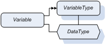
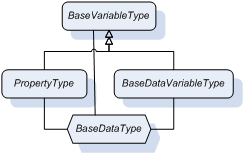
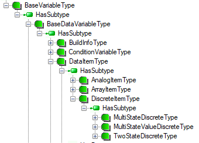
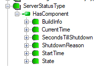
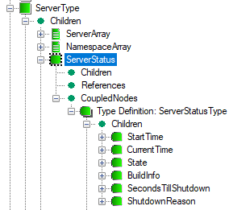
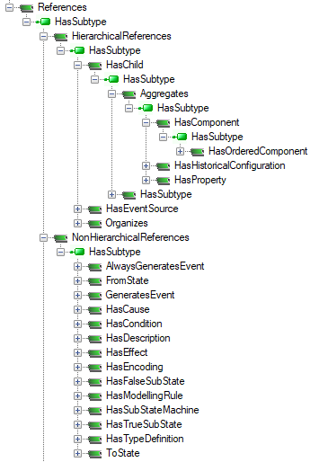
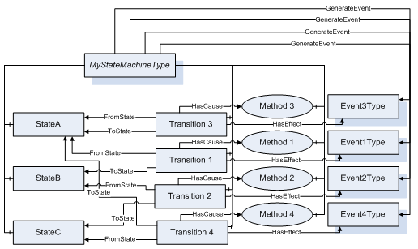

# Standard Information Model

## Object Type

The `Object` `NodeClass` is used to define objects as parts involved in the underling real-time process. Each `Object` in the Address Space has an assigned object type. The OPC UA specification has defined a `BaseObjectType` from which all other `ObjectType`s shall either inherit, directly or indirectly.

The standard types derived from the `BaseObjectType` are listed in Table 1.

Table 1 Standard Object Types

Name  Description
-|-
`ServerType` |Instances of this type provide information about the server to the clients.
`ServerCapabilitiesType`| Instances of this type define the capabilities supported by the OPC UA server.
`ServerDiagnosticsType`| Instances of this type define diagnostic information about the OPC UA server.
`SessionsDiagnosticsSummaryType` | Instances of this type define summary diagnostic information about the client sessions to the OPC UA server.
`SessionDiagnosticsObjectType` | Instances of this type define diagnostic information about the client sessions to the OPC UA server.
`VendorServerInfoType` | Instances of this type are placeholders Object for vendor-specific information about the server. This `ObjectType` defines an empty `ObjectType` that has no components and vendors should derive from this type to expose application specific information.
`ServerRedundancyType` | Instances of this type define the redundancy capabilities supported by the OPC UA server.
`BaseEventType` | Instances of this type define all general characteristics of an Event. All other `EventTypes` derive from it.
`ModellingRuleType` |Instances of this type provide information that identifies what happens when an object of a given type is instantiated.  The instance of this type contains a property `NamingRule` which has the following values i.e. Optional, Mandatory, or Constraint.
`FolderType`| Instances of this type are used to organize the Address Space into a hierarchy of nodes. They represent the root node of a subtree, and have no other semantics associated with them, except the `DisplayName` Attribute should imply the semantics associated with the use of it.
`DataTypeEncodingType` | Objects of this type are used to define `DataType`s of `Variable`s `NodeClass`, e.g. “Default”, “UA Binary” or “XML”.
`DataTypeSystemType` | Objects of this type are used to describe the serialization and deserialization process of the `Value` attributes.

Many of these standard types are used for describing OPC UA Server functionality and to provide diagnostic information. The `BaseEventType` has many specialized subtypes to allow handling most common transient Events. System configuration changes, operator interaction and system errors are examples of Events. OPC UA Part 9 – Alarm and Conditions expands on this object type to define alarm and condition events.

## Variable Type

Variable is dedicated to provide a value to the clients. To define a variable two types must be provided (Figure 1):

- VariableType:  which describes the type of a variable.  A Variable node has a `HasTypeDefinition` reference to its type definition (depicted as double closed and filled arrows).
- DataType: which describes the type of the variable value. It is assigned to the `DataType` attribute.

In this section we focus on the available standard variable types, but in the next one we will review standard data types.

The root for all `VariableType`s is `BaseVariableType` (Figure 2). This means that all other types must inherit from it. The `PropertyType` and the `BaseDataVariableType` are most important for information representation. Consequently, there are two independent inheritance sub-trees.

Both of the above-mentioned types have the same `BaseDataType`, which is abstract and defines a value that can have any valid type (Figure 3).  The double closed arrows point to the source of the `HasSubtype` reference. An interesting feature of these types is that even though they have an abstract `BaseDataType` both are concrete and therefore can be instantiated. Abstract `DataType`s do not have any encoding and cannot be exchanged on the wire; therefore the instantiated variables with an abstract `DataType` must redefine it. The `DataType` attribute can only be changed to a new one if it is a subtype of the original `DataType`.

Dividing the variables into properties and data variables has its source in two different information categories: data and metadata. For example, data can represent a signal, say pressure, and metadata describes the data and can be engineering units in this example. Of course we are not limited to the process control domain; it can be also a file content as the data, and last modification time as the metadata. Both may change in time, but properties are recognized as more stable. Whereas talking about stability is useful only to better understand the semantics difference, this difference has a major impact on the data source access.

Usually data is obtained from smart plant-floor digital devices responsible for converting analog signals to a digital representation. Therefore, to emphasize their origin, we call them real-time process data.

There are many sources of metadata including a human interface, memory of smart plug and play devices, etc. Usually any change of the metadata value exposed as a property is a result of an environment modification, e.g. a new sensor, new accessory, but also a file modification.

In spite of their role, both properties and variables must have a defined type of the provided value to allow clients to interpret a stream of bits sent on the wire and obtained by a client from the server.

It is worth stressing that, according to the specification, the inheritance chain is broken for the properties it means that the `PropertyType` must not have subtypes. Additionally, it is not permitted to have a Property as source of the `HierarchicalReference`s type or any type inherited from it. In other words properties cannot be complex. To prevent recursion, properties are also not allowed to have properties defined for them. Additionally, a node and all its properties shall always reside in the same server.

From the inheritance tree of the standard variable types exposed by the server (Figure 2) we can discover that the `BaseDataVariableType` is a parent of two sets of types dedicated to:

- describe data types, i.e. `DataTypeDictionaryType` and `DataTypeDescriptionType`,
- provide diagnostic information. i.e. `ServerVendorCapabilityType`, `ServerStatusType`, etc.

Users and other parts of OPC UA specification can expand the set of types presented above. For example, Part 8 of the specification defines `DataItemType` that derives from the `BaseDataVariableType` to represent any item of data (see Figure 4). Users can create new types from the already defined ones to meet specific requirements of the application (see example case below). A detailed description of the types derived from the `BaseDataVariableType` is beyond the scope of this chapter, but some features of this inheritance branch are worth noting. As opposed to the properties, the variables may be complex. One example of a complex `VariableType` is the `ServerStatusType` shown in Figure 5. Components of the complex variable can be accessed independently. The next very important future of the variables is that new user specific types can be freely defined by deriving them from those already defined.

## Data Types

The type of data provided by the `Variable` `Value` attribute is defined by the associated `DataType`. `DataType` is pointed out by the `DataType` attribute of the `Variable` and `VariableType` nodes. The `DataType` attribute is of the `NodeId` type (Table 2). In many cases, the value of the `DataType` attribute – called `DataTypeId` – will be well-known to clients and servers. Well-known values of `DataTypeId` allow clients to use random addressing and interpret values without having to read the type description from the server. Therefore, servers may use well-known `DataTypeId` values without representing the corresponding `DataType` nodes in their Address Space.

`DataType` `NodeClass` is dedicated to describe types. In this case, the represented types have a special mission, because they describe data provided by the UA Server to clients. For example, a node of the DataType can provide information to clients that the data has a numeric value and the clients reading it can use this knowledge to interpret and process the obtained value – stream of bits.

The `BaseDataType` is the root of the inheritance tree. The simplified inheritance hierarchy of the standard data types is shown in Figure 6, where the whole sub-tree of built-in types are represented commonly by a single symbol.

Table 2 Built-in Data Types

|Name  |Description |
|-|-|
Boolean | A two-state logical value (true or false).
Byte | An integer value between 0 and 256.
ByteString | A sequence of octets.
DataValue | A data value with an associated status code and timestamps.
DateTime | An instance in time.
DiagnosticInfo | A structure that contains detailed error and diagnostic information associated with a StatusCode.
Double | An IEEE double precision (64 bit) floating point value.
ExpandedNodeId | A NodeId that allows the namespace URI to be specified instead of an index.
ExtensionObject | A structure that contains an application specific data type that may not be recognized by the receiver.
Float | An IEEE single precision (32 bit) floating point value.
GUID | A 16 byte value that can be used as a globally unique identifier.
Int16 | An integer value between -32768 and 32767.
Int32 | An integer value between – 2147483648 and 2147483647.
Int64 | An integer value between – 9223372036854775808 and 9223372036854775807
LocalizedText | Human readable text with an optional locale identifier.
NodeId | An identifier for a node in the Address Space of an OPC UA server.
QualifiedName | A name qualified by a namespace.
SByte | An integer value between -128 and 127.
StatusCode | A numeric identifier for an error or condition that is associated with a value or an operation.
String | A sequence of Unicode characters.
UInt16 | An integer value between 0 and 65535.
UInt32 | An integer value between 0 and 4294967295.
UInt64 | An integer value between 0 and 18446744073709551615.
Variant | A union of all of the types specified above.
XmlElement | An XML element.

To some standard data types – called built-in types - special rules apply. Built-in data types have no encoding visible in the UA Address Space since the encoding should be known to all OPC UA products. Examples of built-in data types are `Int32` and `Double`. The built-in data types with a short description are listed in the Table 2

Most of the built-in types are similar to those known in other IT systems, except the `NodeId` type. This type needs some comments, because it is intended to be used by the random addressing mechanism to represent information allowing clients to uniquely identify and access the nodes. This built-in data type is a structure composed of:

- `namespaceIndex` : numeric values used to identify namespace
- `identifierType`: identifies the type of the `NodeId`, its format and its scope
- `identifier`:  a unique identifier within the context of the namespace

The namespace is a URI (Unique Resource Identifier) that identifies the naming authority responsible for assigning the identifier element of the `NodeId`. Namespace URIs are identified by numeric values in OPC UA Services to permit a more efficient transfer and processing (e.g. table lookups).

Depending on the application requirements, the `identifierType` field may have the following values:

- NUMERIC: numeric
- STRING: text string
- GUID: Globally Unique Identifier
- OPAQUE:  namespace specific format

Enumeration (Figure 6) is the next standard data type derived directly from `BaseDataType`, that needs some comments. It is to be used to represent a limited set of simple information entities. Therefore it is a simple and abstract type. All enumerations, like `NodeClass`, have to inherit from it. All types inheriting from the `Enumeration` have a special processing for the encoding.

Process data could be complex. `Structure` (Figure 6) is an abstract data type defined as the base for all structured types. All data types inheriting from it have a special processing for the encoding. All complex data, if not defined explicitly as primitive in the specification, are created by defining of new types derived from the `Structure`.

When complex data structures should be made available to the client there are basically three different approaches:

- Create several simple variables using simple data types reflecting parts of the structure and map the data structure using these variables as object or variable components
- Create a complex data type and a simple variable using data type derived from `Structure`
- Create a complex data type and a complex variable using this data type and also exposing the complex data structure as variables of the complex variable using simple data types

An example of the first scenario is shown in Figure 5 where a variable of the `ServerStatusType` has components of a simple data type. Advantages of this approach:

- the complex structure of data is visible in the Address Space
- a generic client can easily access the data without any knowledge of user-defined data types
- the client can access individual parts of complex data

Disadvantages of the first approach are that accessing individual data does not provide any transactional context; and for a specific client the server first has to convert data and the client has to convert data, again, to get the data structure the underlying system provides.

An example of the second scenario is shown in Figure 7. Here, the same information as previously is available as a complex data type of the `ServerStatusDataType` that inherits from the Structure. The `ServerStatusDataType` arranges the server status data as a collection of fields. Advantages of this approach:

- data is accessed in a transaction context,
- the complex data type can be constructed in a way that the server does not have to convert data and can pass it directly to the specific client that can directly use it.

Disadvantages are that the generic client might not be able to access and interpret the data or it has the burden to read the `DataTypeDescription` to interpret the data. The data structure is not visible in the Address Space; additional Properties describing the data structure cannot be added to the data type. Individual parts of data cannot be read without accessing the whole data structure.

The third approach combines both other approaches. The specific client can, therefore, access data in its native format in a transactional context, whereas the generic client can access the simple data types of the components of the complex variable. The disadvantage is that the server has to be able to provide the native format and also interpret it to be able to provide information in simple data types. In some SDK’s support for this mapping is provided automatically; for example the OPC .NET SDK will provide this mapping as part of its code generator for user defined types.

When a transactional context is needed or the client should be able to get a large amount of data instead of subscribing to several individual values, the third approach is suitable. However, the server might not always have the knowledge how to interpret complex data or be able to have predefined structures for the complex data of the underlying system and it, therefore, has to use the second approach just passing data to the specific client who is able to interpret the data.

## Reference Types

Reference types are used to create interconnections between nodes. They are not instantiated, i.e. a NodeClass representing a reference is not defined. Instead of instantiating the references, they are added to a collection associated with each node. NodeClass of the node and its type decide what references are allowed to be added to this collection.
The base of all references is an abstract References type (Figure 8). There is no semantics associated with it.
There are two disjoint sets of standard references:

- `HierarchicalReferences`
- `NonHierarchicalReferences`

This distinction reflects two fundamental relationship categories that can be generally distinguished: the association and the dependency. Associations are used to build information architecture – nodes hierarchy - that can be discovered by the clients using the browsing mechanism. An example of the association is the parent/child relationship. In this case we can say that the target belongs to the source. A dependency from a source element (called the client) to a target element (called the supplier) indicates that the source element uses or depends on the target element. An example of dependency is the variable and variable type relationship. In this case we can state that the target describes the source.

`HierarchicalReferences` do not forbid loops. For example, starting from node “A” and following `HierarchicalReferences` may lead to browse to node “A” again.

`HasChild` is an abstract type derived from `HierarchicalReferences` that creates a branch of types, which forbids loops. In this case, starting from node “A” and only following references, which are subtypes of `HasChild`, we shall never be able to return to “A”. But it is allowed that there may be more than one path leading to another node “B”.

The `HasChild` branch contains `HasComponent` and `HasProperty`. Both are derived from the Aggregates type and used to reflect the parent – child relationship. There is also `HasSubtype` on this branch, but in this case it is used to expose the inheritance hierarchy.

Table 3 `HasComponent` usage scope

Source | Target
-|-
Object, ObjectType| Object, Variable, Method
DataVariable, VariableType | Variable

The `HasComponent` is derived from the `Aggregates` (Figure 8) is defined to build the part of relationship, i.e. the target node of `HasComponent` is a part of the source node. This type is used to relate objects, object types, variables and methods. Table 3 contains the allowed composite nodes (source) and allowed components as the target of this type of reference. By using this reference, the variable is defined as a `DataVariable`.

The semantics of `HasProperty` derived from `Aggregates` (Figure 8) is to identify the properties of a node. The source node of this type can be of any `NodeClass`. The target node shall be a variable. By using the `HasProperty`, the variable is defined as `Property`. Since properties shall not have properties, a property shall never be the source node of a `HasProperty` reference.

An example of a complex object using the references described above is shown in Figure 9. The `ServerType` has `HasProperty` references pointing to the `ServerArray`, `NamespaceArray`, `ServiceLevel` and Auditing properties. The `ServerStatus` is a child variable pointed by a reference of the `HasComponent` type. Objects of this type have also components: `ServerCapabilities`, `ServerDiagnostics`, `VendorServerInfo`, `ServerRedundancy` objects pointed also by a reference of the `HasComponent` type.

The `HasSubtype` is a subtype of the `HasChild` type. It is worth noting, that inheritance using HasSubtype is represented using the one-to-many (parent/child) relationship. Because new types can be freely derived from the existing ones we cannot enumerate all children in advance - the tree must be built and maintained dynamically during the life-cycle of the Address Space. This means that when a new type is created it is created with a reference to its base (parent), which results in a new subtype being added to the parent.

The `Organizes` is the next subtype of `HierarchicalReferences`. The semantics of it is to organize nodes in the Address Space. It can be used to span multiple hierarchies independent of any hierarchy created with the non-looping `Aggregates` references. The source node of references of this type shall be an object or a view. If it is an object it should be an object of the `FolderType` or one of its subtypes. The target node of this type can be of any `NodeClass`.

## State machines

The information model provides constructs that can be used to model discrete object behavior in terms of the states an object can reside in and the transitions that can happen between those states. State machines (see example in Figure 10) are built as objects graph using dedicated object types, variable types and reference types, whose behavior is governed by the rules that must be strictly observed.

A state is a condition in which an object can be at some point during its lifetime, for some finite amount of time. A transition is a change of an object from one state (the source state) to another (the target state).  The transition is triggered ("fires") when an event of interest – cause - to a given object occurs. According to the information model concept, causes are represented in the form of methods that have to be called, but a vendor can define other items or have them be internal (i.e. nothing is listed causing the transition). There may also be an action associated with a triggered transition. This action called an effect is executed unconditionally before the object enters the target state. Effects are events that are generated.

The simplified state machine model described above can be freely expanded to provide more complex functionality like sub-machines, parallel states, forks and joins, history states, choices and junctions, etc.

State machines are represented in the Address Space as an object of a type derived from the `StateMachineType` that defines a single variable of the `StateVariableType`, which represents the current state of the machine. An instance of the `StateMachineType` shall generate an event whenever a state change occurs. Transitions are represented as objects of the `TransitionType`. Each valid transition shall have exactly one `FromState` reference and exactly one `ToState` reference, each pointing to an object of the `StateType`.

Using the above terminology we can represent any state machine from Figure 10 as a diagram shown in Figure 11. For this diagram it is assumed that `MyStateMachineType` is derived directly or indirectly from the `StateMachineType`. All states, transitions and methods are components of this type.
