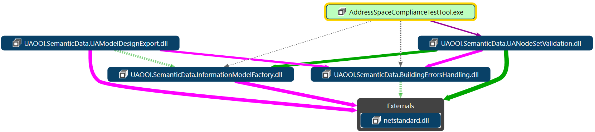

# `UAModelDesignExport` Library

## Preface

The Address Space concept based on types can be a foundation for exposing any process information. The main role of the Address Space is a selective replication of an underlying process, i.e.copying of data from a real process to one Address Space so that all users share the same process state and behavior description. Using the Address Space concept implementation (services) users could also control the underlying process. It is worth stressing that by design the replica hides selected details, hence we can recognize it as an abstract representation of the underlying process.The data stored in a cache might be the result of an earlier computation or a copy of data stored elsewhere. Hence, the Address Space is also a cache of the real process data. Concluding, it is a component that stores data so that future requests for that data can be served in a unified and more efficient way.

To make the Address Space a meaningful representation of the real process for a variety of generic data users it must expose process real data in the context of metadata. The Address Space is a collection of nodes that are instances of predefined types (`NodeClass`). Each `NodeClass` is defined as an invariable set of named attributes and a collection of references that shall be assigned (given) values when the node is instantiated.
 
Numerous elements contribute to the overall process of creating and managing real process replication using the Address Space concept. A detailed description of the topic is covered by the section [Information Models Development](../../SemanticData/InformationModelsDevelopment.md).

In general, two scenarios can be applied to create an instance of the Address Space:

1. step-by-step: users manage it using services available by the API (Application Program Interface)
2. en block: a hosting software application instantiates the Address Space as one whole using a formal description 

At run-time, the step-by-step approach can be applied using `NodeManagement Service Set` defined in [OPC UA Part 4: Services[Part4].  This Service Set defines Services to add and delete nodes and references between them in the Address Space that is part of the OPC UA Server application.

Because the step-by-step approach shall be recognized as the run-time custom approach where the Address Space nodes graph depends on the behavior of users functionality it will not be discussed in more details.

To promote en block scenario and to create all nodes all together in a united group making up the Address Space content there is a need for a standard syntax that can be used to represent it in a form that can be read by a computer program. The [OPC UA Part 6 - Mappings][Opc.UA.Part6] defines an XML-based schema for this purpose:

> `http://opcfoundation.org/UA/2011/03/UANodeSet.xsd`

The XML documents compliant with this schema are called `UANodeSet`. This schema can also be used to serialize (i.e. import or export) an arbitrary set of Nodes in the Server Address Space. This serialized form can be used to save Server state for use by the Server later or to exchange with other applications (e.g. to support out-of-band configuration by a Client). The `UANodeSet` documents could also be obtained as an output of a compiler processing OPC UA Information Model as the input.

> Regardless of the method applied to the generation of the `UANodeSet` manual modification of the document compliant with this schema is impractical or even impossible.

To promote reusability, the publication of process real-time data and metadata in the Address Space requires a prior model development at design-time. From the section [Address Space Model Life-cycle][ASMLC], we can learn that design, development, deployment, and maintenance is a multi-phase engineering process. Moreover, the model deployment process varies depending on the server implementation.  From this section, we can learn that there is a need for a domain-specific language that can be used to represent the OPC UA Information Model in a form that can be suitable for a selected development environment helping architects, engineers, and developers accomplish the above-mentioned tasks and follow the best practice rules.  A domain-specific language is developed to meet a specific need. In this sense, a domain is a narrow area of interest, i.e. representation of the OPC UA Information Model.

A language, domain-specific or not, consist of the following main ingredients:

- alphabet: a set of readable letters or symbols in a fixed order
- syntax: defines the notation with which users can express the relevant information (in this case the OPC UA Information Model). It may be textual, graphical, tabular or a mix of these 
- semantics - a set of rules that can be used to assign the meaning to the notation that is valid against syntax rules

The [OPC UA Part 3][Opc.UA.Part3] defines a graphical notation for this purpose. It is normative, however, it is not required to be used. Graphical languages have the following drawbacks:

1. the drawing becomes huge and hard to maintain in case of complex models
2. it is impractical or even impossible to track the model modifications
3. the graphical representation is hard to be processed by computers

Additionally, according to the specification, this graphical notation provides no mechanism to represent some important information required by a generic OPC UA Information Model representation.
 
In some development environment, the Unified Modeling Language (UML) is also used instead. It is a standardized modeling language enabling developers to specify, visualize, construct and document artifacts of any information processing system.  Because it is the generic language it doesn't have any related to the OPC UA Information Model  well-defined semantics rules, so the association of the diagrams and their meaning must be based on intuition limiting the possibility to share the models.

> Therefore instead of graphical notation, a textual `ModelDesign` notation is commonly used as the domain-specific language supporting OPC UA Information Model design.

## `ModelDesign` - what's this

This library provides an implementation of the functionality aimed at the generation of the XML files compliant with the following schema

> `http://opcfoundation.org/UA/ModelDesign.xsd`
 
The documents compliant with this schema are referred to as `ModelDeign`. The schema definition is in the local file [UA Model Design.xsd](XML/UA%20Model%20Design.xsd) attached to the project.

By design, the `ModelDesign` schema describes the syntax of XML documents that are to be a representation of the OPC UA Information Model. These models may be defined by standardization organizations, vendors or end-users. More on designing and deploying OPC UA Information Model is covered by the section [Information Models Development](../../SemanticData/InformationModelsDevelopment.md).
 
## `ModelDesign` - how to use it

### Introduction

From the above, we can learn that design, development, deployment, and maintenance of the OPC UA Information Model is a multi-phase engineering process. Moreover, the model deployment varies depending on the server implementation. All of that causes that configuration, behavior and process data binding of the server is a complex task and that is why a development environment is required to help architects, engineers, and developers accomplish this task following the best practice rules. This development tools should support all aspects of the model deployment process including edition, validation, visualization, behavior/data binding definition, and generation of all files allowing the server to expose real-time process data in the context of metadata.

Before nodes making up the Address Space can be instantiated by the server, the Address Space must be designed first. Model designing is a process aimed at defining a set of types and their associations and, next, creating an Address Space representation in a format appropriate for implementation. The `ModelDesign` files are used by many tools to help:

1. Design and instantiate the Address Space
2. Add custom behavior represented in the Address Space by Method nodes
3. Bidirectionally bind Variable nodes Value attribute with a real process data 

A more detailed description of this topic is captured in the section [Address Space Model Life-cycle][ASMLC]

In the next sections, two tools supporting the OPC UA Information Model deployment process are described. Both use the `ModelDesign` files format as the input for further processing.

### OPC Foundation UA-ModelCompiler

XML documents compliant with the `ModelDesign` schema may be used as the input for the compiler tool [`OPC Foundation UA-ModelCompiler`](https://github.com/OPCFoundation/UA-ModelCompiler). This compiler generates XML files that may be used to instantiate the UA Address Space complaint wit the [OPC UA Part 3][Opc.UA.Part3]. It also creates the C# and ANSI C source code files which include the UA Services, data-types, error codes, etc.; and variety of the CSV files that contain NodeIds, error codes, and attributes, etc. Visit the above-mentioned home page of this tool to learn more. It is command-line tools and doesn't provide any UA Information Model design functionality.

### Address Space Model Designer

he main challenge of the project OPC UA Address Space Model Designer is to bring together: learning, training and designing. To meet our objectives, we have just released:

Documentation as a help collection containing linked topics recommended as a starting point to understand, design, develop and implement the Unified Architecture Address Space

OPC UA Address Space Model Designer that is a user-friendly tool supporting all aspects of the Address Space model designing process

Documentation containing information about the OPC UA Address Space Model Designer tool

To make this tool as useful as possible, the definition of the created Address Space can be saved to the XML file compatible with the schema used by the UA Software Development Kit released by the OPC Foundation.

Using the proposed approach you can learn how to develop, design a model, save it as XML and explore the created Address Space in the Unified Architecture environment in a couple of hours.

Use it as project folder for ASMD ......

## How to get started

## How to install the library using NuGet package

This library is available as the NuGet package `UAOOI.SemanticData.UAModelDesignExport`. NuGet packages contain reusable code that other developers make available to you for use in your projects. See [What is NuGet?][nuget-intro] for background. Packages are installed into a Visual Studio project using the Package Manager UI or the Package Manager Console. The article [Quickstart: Install and use a package in Visual Studio][nuget-install][nuget-install] demonstrates the process using an example.

## See also

- [Information Models Development](../../SemanticData/InformationModelsDevelopment.md)
- [An introduction to NuGet][nuget-intro]
- [Quickstart: Install and use a package in Visual Studio][nuget-install]
- [Address Space Model Life-cycle][ASMLC]
- [OPC Unified Architecture Specification Part 3: Address Space Model, OPC Foundation, Rel. 1.04, 2017-11-22][Opc.UA.Part3]
- [OPC Unified Architecture Specification Part 4: Services, OPC Foundation, Rel. 1.04, 2017-11-22][Opc.UA.Part4]
- [OPC Unified Architecture Specification Part 6: Mappings, OPC Foundation, Rel. 1.04, 2017-11-22][OPC.UA.Part6]
 
[nuget-intro]:https://docs.microsoft.com/en-us/nuget/what-is-nuget
[nuget-install]:https://docs.microsoft.com/en-us/nuget/quickstart/install-and-use-a-package-in-visual-studio
[ASMLC]:../InformationModelLifecycle.md
[Opc.UA.Part3]:https://opcfoundation.org/developer-tools/specifications-unified-architecture/part-3-address-space-model/
[Opc.UA.Part6]:https://opcfoundation.org/developer-tools/specifications-unified-architecture/part-6-mappings/
[Opc.UA.Part4]:https://opcfoundation.org/developer-tools/specifications-unified-architecture/part-4-services/