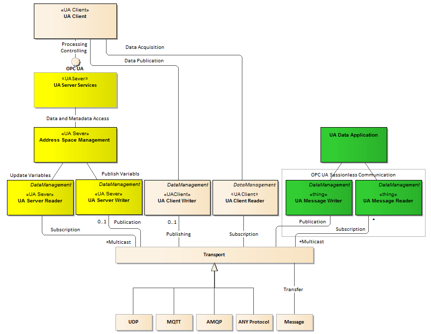

# UA Semantic Data Message Centric Communication

To realize the [*UA Semantic Data*](../SemanticDataSolution/README.MD#opc-ua-data-processing-outside-the-server) paradigm in practice **UA Data Application** must get access to the data in the context of type definition in compliance with the OPC UA *Information Model*. This article summarizes research on the architecture of infrastructure supporting access to the data using a *Message Centric* communication pattern. The proposed architecture is presented in the following figure.

The architecture contains the following classes directly involved in the data processing:

1. **UA Data Application** - a program application that processes OPC UA Data available out of band, i.e. without the necessity of creating an OPC UA session.
2. OPC **UA Client** - a program application that processes OPC UA Data available throughout the created OPC UA session using standard services.
3. **UA Server Services** - a typical part of any OPC UA server that provides standard services.
4. **Address Space Management** - a typical part of any OPC UA server that manages the nodes in the *Address Space*.

**UA Data Application** is an application program processing the data in the context of the OPC UA metadata outside the OPC UA server session. In the presented architecture it gets access to the **UA Semantic Data** using the underlying **Transport** supporting networking services compliant with the *Message Centric* communication pattern standardized in [OPC Unified Architecture Specification Part 14 PubSub](https://opcfoundation.org/developer-tools/specifications-unified-architecture/part-14-pubsub/). As opposed to OPC UA *Session Centric* communication the **Transport** by design is not responsible for distributing type definitions at run time. To realize the **UA Semantic Data** paradigm, the data sent over the network must, therefore, be decorated with an unique identifier to find the context prepared in advance against the type definition (semantics), e.g. a picture to display the data, an algorithm to calculate new values, a key to encrypt the message payload, etc. For example, **UA Data Application** may be any remote mobile device according to the *Internet of Things* architecture concept, interested in publishing process data using the remote OPC UA server. It's even possible to connect household appliances, sensors and other devices to a central application. For example, it could browse a message broker (**Transport**) against defined topics, like a definition, that represent data to be published in the OPC UA *Address Space*. For example, IEC61850-enabled IEDs that get digitalized power grid condition data via process bus and merge units.

**UA Server Services** class is an embedded part of any OPC UA server. **UA Server Services** shall be compliant with OPC UA Specification Part 4, i.e. it must be tested against interoperability for selected standard profile. **Address Space Management** is also a typical part of any OPC UA server. It is responsible for creation and management of the OPC UA *Address Space*. Optionally, the server *Address Space* could expose *Information Models* defined by companion specifications, organizations and users.

To leverage [processing of the OPC UA Data outside the OPC UA session](../SemanticDataSolution/README.MD#opc-ua-data-processing-outside-the-server) using data networking, the above mentioned classes shall support *Message Centric* data exchange pattern using a selected underlying network transport. In this case, the following additional optional roles may be considered for them:

1.	Data producer: supported by the writer component populating the messages with the locally obtained data and sending them over the underlying network **Transport**.
2.	Data consumer: supported by the reader component receiving messages from the network **Transport** and recovering the UA Data from the messages.

To promote interoperability it has to be assumed that producers and consumers must be compliant with an industrial standard. It is proposed to meet this requirement applying the emerging [OPC UA Standard Part 14 PubSub](https://opcfoundation.org/developer-tools/specifications-unified-architecture/part-14-pubsub/). The possibility of implementing *UA Semantic Data* networking according to the presented architecture may be recognized as a proof of concept for that standard. Interoperability rules must create a common foundation for:

1. Messages encoding, decoding and protecting against malicious users.
2. Association of the data with the data meaning – semantics.

Encoding means that data is represented as a stream of bits according to selected data type, for example long, float, string, structure, etc. Semantic rules are used to find an appropriate semantics context (object type definition) for further processing, for example recognize the data as an output temperature of a boiler.

The **UA Server Writer** (data producer role) and **UA Server Reader** (data consumer role) may support out of band interconnection of the nodes exposed in the *Address Space* and applications using the *Message Centric* communication pattern. In this context out of band means that the applications do not need to establish a session to exchange data. The data is distributed by transmitting messages over the underlying **Transport**. Data exchange between nodes in the *Address Space* and *Message Centric* environment resembles the data exchange with the underlying process using a field level protocol, for example Modbus. The main difference is that from the process perspective (not shown in the figure above) any new value of a *Variable* node is usually injected into the process as a new control value with the purpose of changing its behavior. From the networking perspective, values representing measurements and control signals are treated equally.

The **UA Client Writer** (data producer role) and **UA Client Reader** (data consumer role) associated with the OPC **UA Client** may be used to create a communication bridge between *Session Centric* and *Message Centric* environments. In the presented architecture OPC **UA Client** is a functional class that shall be compliant with OPC UA Specification Part 4. In the bridge scenario data may, additionally, be converted to different syntax and semantics rules leveraging integration of different Industrial IT systems. The main advantage of this archetype is its passive nature, i.e. the possibility of using it in the existing environment.

The **UA Message Writer** (data producer role) and **UA Message Reader** (data consumer role) writes and reads messages from the underlying **Transport**. It is assumed that messages contain current values of the selected *Variable* nodes exposed by an OPC UA server in the *Address Space*. It is worth noting that data meaning, i.e. data semantics, but not where the data come from, is the most important thing in this processing scenario. The **UA Message Reader** by design is responsible for recovering the information from the message and matching appropriate context for further processing. This operation is called process data binding. To make the data recognizable in the context of a definition in the selected OPC UA *Information Model*, the **UA Message Writer** by design is responsible for decorating the populated message using local data with a definition identifier. Using the information, for example, the **UA Server Reader** associates the *Variable* nodes and data items recovered from the message.

The main role of the **Transport** layer is to transfer messages containing OPC UA data from the source to ultimate destination node. The following communication patterns can be applied:

* Publish-subscribe (PubSub): senders of messages, called publishers, do not program the messages to be sent directly to specific receivers (no direct addressing, alternatively topics/threads/queues are used), called subscribers.
* Forwarding: senders directly address a receiver (unicasting) or receivers (multicasting) of the message. If a receiver has not requested the message in advance it is unsolicited communication.

Simplifying, the PubSub pattern resembles RSS, while forwarding resembles an email.
